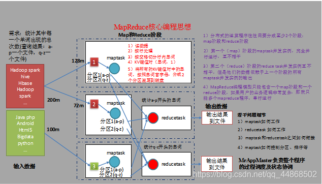
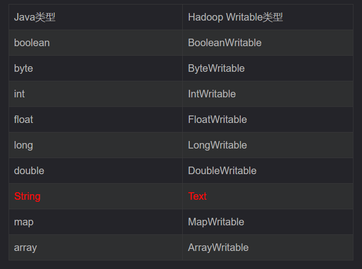
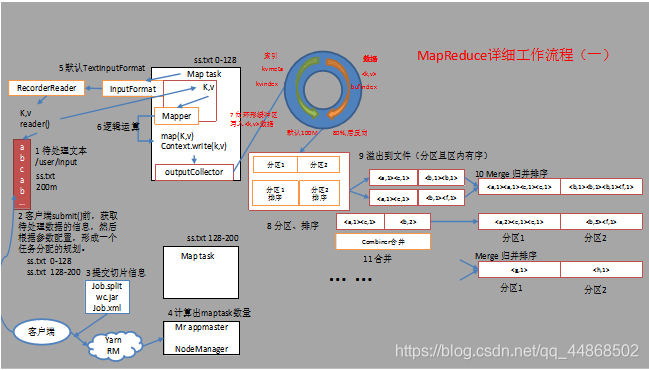
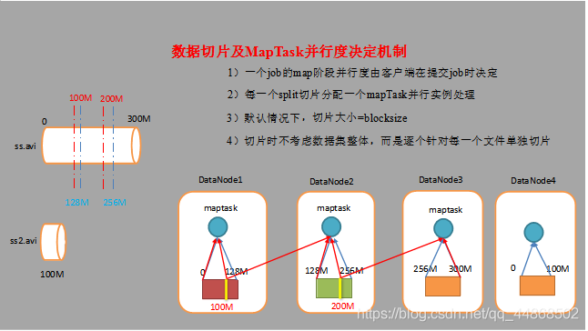
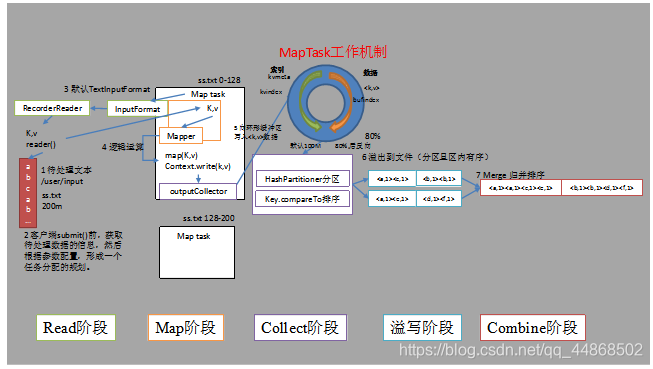
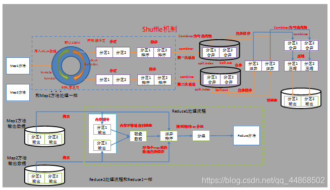
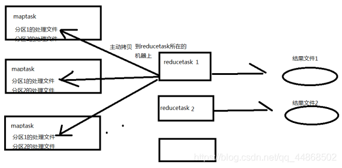
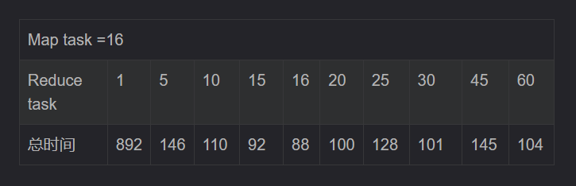

第1章 MapReduce入门
1.1 MapReduce定义
Mapreduce是一个分布式运算程序的编程框架，是用户开发“基于hadoop的数据分析应用”的核心框架。

Mapreduce核心功能是将用户编写的业务逻辑代码和自带默认组件整合成一个完整的分布式运算程序，并发运行在一个hadoop集群上。

1.2 MapReduce优缺点
1.2.1 优点
1．MapReduce 易于编程

它简单的实现一些接口，就可以完成一个分布式程序，这个分布式程序可以分布到大量廉价的PC机器上运行。就是因为这个特点使得MapReduce编程变得非常流行。

2．良好的扩展性

当计算资源不能得到满足的时候，可以通过简单的增加机器来扩展它的计算能力。

3．高容错性

MapReduce设计的初衷就是使程序能够部署在廉价的PC机器上，这就要求它具有很高的容错性。比如其中一台机器挂了，它可以把上面的计算任务转移到另外一个节点上运行，不至于这个任务运行失败，而且这个过程不需要人工参与，而完全是由Hadoop内部完成的。

4．适合PB级以上海量数据的离线处理

它适合离线处理而不适合在线处理。比如像毫秒级别的返回一个结果，MapReduce很难做到。

1.2.2 缺点
MapReduce不擅长做实时计算、流式计算、DAG（有向图）计算。

1. 实时计算

MapReduce无法像Mysql一样，在毫秒或者秒级内返回结果。

2. 流式计算

流式计算的输入数据是动态的，而MapReduce的输入数据集是静态的，不能动态变化。这是因为MapReduce自身的设计特点决定了数据源必须是静态的。

3. DAG（有向图）计算

多个应用程序存在依赖关系，后一个应用程序的输入为前一个的输出。在这种情况下，MapReduce并不是不能做，而是使用后，每个MapReduce作业的输出结果都会写入到磁盘，会造成大量的磁盘IO，导致性能非常的低下。

1.3 MapReduce核心思想
MapReduce核心思想，如图



1）分布式的运算程序往往需要分成至少2个阶段。

2）第一个阶段的maptask并发实例，完全并行运行，互不相干。

3）第二个阶段的reduce task并发实例互不相干，但是他们的数据依赖于上一个阶段的所有maptask并发实例的输出。

4）MapReduce编程模型只能包含一个map阶段和一个reduce阶段，如果用户的业务逻辑非常复杂，那就只能多个mapreduce程序，串行运行。

1.4 MapReduce进程（MR）
一个完整的mapreduce程序在分布式运行时有三类实例进程：

1）MrAppMaster：负责整个程序的过程调度及状态协调。

2）MapTask：负责map阶段的整个数据处理流程。

3）ReduceTask：负责reduce阶段的整个数据处理流程。

1.5 MapReduce编程规范
用户编写的程序分成三个部分：Mapper、Reducer和Driver。

1．Mapper阶段

（1）用户自定义的Mapper继承Mapper

（2）Mapper的输入数据是KV对的形式（KV的类型可自定义）

（3）Mapper中的业务逻辑写在map()方法中

（4）Mapper的输出数据是KV对的形式（KV的类型可自定义）

（5）map()方法（maptask进程）对每一个<K,V>调用一次

2．Reducer阶段

（1）用户自定义的Reducer继承Reducer

（2）Reducer的输入数据类型对应Mapper的输出数据类型，也是KV

（3）Reducer的业务逻辑写在reduce()方法中

（4）Reducetask进程对每一组相同k的<k,v>组调用一次reduce()方法

3．Driver阶段(关联Mapper和Reducer，并且提交任务到集群)

相当于yarn集群的客户端，用于提交我们整个程序到yarn集群，提交的是封装了mapreduce程序相关运行参数的job对象

第2章 Hadoop序列化
2.1 序列化概述
2.1.1 什么是序列化
序列化就是把内存中的对象，转换成字节序列（或其他数据传输协议）以便于存储（持久化）和网络传输。 

反序列化就是将收到字节序列（或其他数据传输协议）或者是硬盘的持久化数据，转换成内存中的对象。

2.1.2 为什么要序列化
        一般来说，“活的”对象只生存在内存里，关机断电就没有了。而且“活的”对象只能由本地的进程使用，不能被发送到网络上的另外一台计算机。 然而序列化可以存储“活的”对象，可以将“活的”对象发送到远程计算机。

2.1.3 为什么不用Java的序列化 serilazable
 Java的序列化是一个重量级序列化框架（Serializable），一个对象被序列化后，会附带很多额外的信息（各种校验信息，header，继承体系等），不便于在网络中高效传输。所以，hadoop自己开发了一套序列化机制（Writable），特点如下：

1．紧凑

紧凑的格式能让我们充分利用网络带宽，而带宽是数据中心最稀缺的资源

2．快速

进程通信形成了分布式系统的骨架，所以需要尽量减少序列化和反序列化的性能开销，这是基本的；

3．可扩展

协议为了满足新的需求变化，所以控制客户端和服务器过程中，需要直接引进相应的协议，这些是新协议，原序列化方式能支持新的协议报文；

4．互操作

能支持不同语言写的客户端和服务端进行交互； 

2.2 常用数据序列化类型
表4-1 常用的数据类型对应的hadoop数据序列化类型


2.3 自定义bean对象实现序列化接口（Writable）
自定义bean对象要想序列化传输，必须实现序列化接口，需要注意以下7项。

（1）必须实现Writable接口

（2）反序列化时，需要反射调用空参构造函数，所以必须有空参构造
```

public FlowBean() {

super();

}
```
（3）重写序列化方法
```
@Override

public void write(DataOutput out) throws IOException {

out.writeLong(upFlow);

out.writeLong(downFlow);

out.writeLong(sumFlow);

}
```
（4）重写反序列化方法
```
@Override

public void readFields(DataInput in) throws IOException {

upFlow = in.readLong();

downFlow = in.readLong();

sumFlow = in.readLong();

}
```
（5）注意反序列化的顺序和序列化的顺序完全一致

（6）要想把结果显示在文件中，需要重写toString()，可用”\t”分开，方便后续用。

第3章 MapReduce框架原理
3.1 MapReduce工作流程
1．流程示意图，如图所示



2．流程详解

上面的流程是整个mapreduce工作流程，但是shuffle过程只是从第7步开始到第16步结束，具体shuffle过程详解，如下：

1）maptask收集我们的map()方法输出的kv对，放到内存缓冲区中

2）从内存缓冲区不断溢出本地磁盘文件，可能会溢出多个文件

3）多个溢出文件会被合并成大的溢出文件

4）在溢出过程中，及合并的过程中，都要调用partitioner进行分区和针对key进行排序

5）reducetask根据自己的分区号，去各个maptask机器上取相应的结果分区数据

6）reducetask会取到同一个分区的来自不同maptask的结果文件，reducetask会将这些文件再进行合并（归并排序）

7）合并成大文件后，shuffle的过程也就结束了，后面进入reducetask的逻辑运算过程（从文件中取出一个一个的键值对group，调用用户自定义的reduce()方法）

3．注意

Shuffle中的缓冲区大小会影响到mapreduce程序的执行效率，原则上说，缓冲区越大，磁盘io的次数越少，执行速度就越快。

缓冲区的大小可以通过参数调整，参数：io.sort.mb  默认100M。

3.2 InputFormat数据输入
2．FileInputFormat操作流程

（1）找到你数据存储的目录。

（2）开始遍历处理（规划切片）目录下的每一个文件

（3）遍历第一个文件xx.txt

a）获取文件大小fs.sizeOf(xx.txt)

b）默认情况下，切片大小=blocksize

c）开始切，形成第1个切片：ss.txt—0:128M 第2个切片ss.txt—128:256M 第3个切片ss.txt—256M:300M（每次切片时，都要判断切完剩下的部分是否大于块的1.1倍，不大于1.1倍就划分一块切片）  剩下部分大于128m但是小于140m

e）将切片信息写到一个切片规划文件中

f）数据切片只是在逻辑上对输入数据进行分片，并不会再磁盘上将其切分成分片进行存储。使用InputSplit只记录了分片的元数据信息，比如起始位置、长度以及所在的节点列表等

h）注意：block是HDFS物理上存储的数据，切片是对数据逻辑上的划分

（4）提交切片规划文件到yarn上，yarn上的MrAppMaster就可以根据切片规划文件计算开启maptask个数。

3.2.2 FileInputFormat切片机制
1．FileInputFormat中默认的切片机制

（1）简单地按照文件的内容长度进行切片

（2）切片大小，默认等于block大小

（3）切片时不考虑数据集整体，而是逐个针对每一个文件单独切片

比如待处理数据有两个文件：
```
file1.txt    320M

file2.txt    10M
```
经过FileInputFormat的切片机制运算后，形成的切片信息如下：  
```
file1.txt.split1--  0~128

file1.txt.split2--  128~256

file1.txt.split3--  256~320

file2.txt.split1--  0~10M
```
3.2.3 CombineTextInputFormat切片机制
关于大量小文件的优化策略

默认情况下TextInputformat对任务的切片机制是按文件规划切片，不管文件多小，都会是一个单独的切片，都会交给一个maptask，这样如果有大量小文件，就会产生大量的maptask，处理效率极其低下。

1．优化策略

（1）最好的办法，在数据处理系统的最前端（预处理/采集），将小文件先合并成大文件，再上传到HDFS做后续分析。

（2）补救措施：如果已经是大量小文件在HDFS中了，可以使用另一种InputFormat来做切片（CombineTextInputFormat），它的切片逻辑跟TextFileInputFormat不同：它可以将多个小文件从逻辑上规划到一个切片中，这样，多个小文件就可以交给一个maptask。

（3）优先满足最小切片大小，不超过最大切片大小

CombineTextInputFormat.setMaxInputSplitSize(job, 4194304); // 4m  

CombineTextInputFormat.setMinInputSplitSize(job, 2097152); // 2m   

举例：0.5m+1m+0.3m+5m=2m + 4.8m=2m + 4m + 0.8m

2．具体实现步骤

//  如果不设置InputFormat,它默认用的是TextInputFormat.class

job.setInputFormatClass(CombineTextInputFormat.class)

CombineTextInputFormat.setMaxInputSplitSize(job, 4194304);// 4m

CombineTextInputFormat.setMinInputSplitSize(job, 2097152);// 2m

3.3 MapTask工作机制
3.3.1 并行度决定机制
1．问题引出

maptask的并行度决定map阶段的任务处理并发度，进而影响到整个job的处理速度。那么，mapTask并行任务是否越多越好呢？

2．MapTask并行度决定机制

一个job的map阶段MapTask并行度（个数），由客户端提交job时的切片个数决定，如图所示。



3.3.2 MapTask工作机制
MapTask工作机制如图所示



（1）Read阶段：Map Task通过用户编写的RecordReader，从输入InputSplit中解析出一个个key/value。

（2）Map阶段：该节点主要是将解析出的key/value交给用户编写map()函数处理，并产生一系列新的key/value。

（3）Collect收集阶段：在用户编写map()函数中，当数据处理完成后，一般会调用context.write，context.write底层 OutputCollector.collect()输出结果。在该函数内部，它会将生成的key/value分区（调用Partitioner），并写入一个环形内存缓冲区中。

（4）Spill阶段：即“溢写”，当环形缓冲区满后，MapReduce会将数据写到本地磁盘上，生成一个临时文件。需要注意的是，将数据写入本地磁盘之前，先要对数据进行一次本地排序，并在必要时对数据进行合并等操作。

（5）Combine阶段：当所有数据处理完成后，MapTask对所有临时文件进行一次合并，以确保最终只会生成一个数据文件。

在进行文件合并过程中，MapTask以分区为单位进行合并。对于某个分区，它将采用多轮递归合并的方式。每轮合并io.sort.factor（默认100）个文件，并将产生的文件重新加入待合并列表中，对文件排序后，重复以上过程，直到最终得到一个大文件。

3.4 Shuffle机制
3.4.1 Shuffle机制(洗牌)
Mapreduce确保每个reducer的输入都是按key排序的。系统执行排序的过程（即将mapper输出作为输入传给reducer）称为shuffle，如图所示。



3.4.2 Partition分区
分区：把数据扎堆存放

问题引出：要求将统计结果按照条件输出到不同文件中（分区）。比如：将统计结果按照手机归属地不同省份输出到不同文件中（分区）

默认partition分区 hello-->hash%reducetask数量--2 ；0，1
```
public class HashPartitioner<K, V> extends Partitioner<K, V> {

  public int getPartition(K key, V value, int numReduceTasks) {

    return (key.hashCode() & Integer.MAX_VALUE) % numReduceTasks;

  }

}
```
默认分区是根据key的hashCode对reduceTasks个数取模得到的。用户没法控制哪个key存储到哪个分区。

2．自定义Partitioner步骤

（1）自定义类继承Partitioner，重写getPartition()方法
```
public class ProvincePartitioner extends Partitioner<Text, FlowBean> {

@Override

public int getPartition(Text key, FlowBean value, int numPartitions) {

// 1 获取电话号码的前三位

String preNum = key.toString().substring(0, 3);

int partition = 4;

// 2 判断是哪个省

if ("136".equals(preNum)) {

partition = 0;

}else if ("137".equals(preNum)) {

partition = 1;

}else if ("138".equals(preNum)) {

partition = 2;

}else if ("139".equals(preNum)) {

partition = 3;

}

return partition;

}

}
```
（2）在job驱动中，设置自定义partitioner：
```
job.setPartitionerClass(CustomPartitioner.class);
```
（3）自定义partition后，要根据自定义partitioner的逻辑设置相应数量的reduce task
```
job.setNumReduceTasks(5);
```
注意
reduceTask的个数决定了有几个文件！！

如果reduceTask的数量> getPartition的结果数，则会多产生几个空的输出文件part-r-000xx；

如果1<reduceTask的数量<getPartition的结果数，则有一部分分区数据无处安放，会Exception；

如果reduceTask的数量=1，则不管mapTask端输出多少个分区文件，最终结果都交给这一个reduceTask，最终也就只会产生一个结果文件 part-r-00000；

例如：假设自定义分区数为5，则

（1）job.setNumReduceTasks(1);会正常运行，只不过会产生一个输出文件

（2）job.setNumReduceTasks(2);会报错

（3）job.setNumReduceTasks(6);大于5，程序会正常运行，会产生空文件

3.4.3 WritableComparable排序
排序是MapReduce框架中最重要的操作之一。Map Task和Reduce Task均会对数据（按照key）进行排序。该操作属于Hadoop的默认行为。任何应用程序中的数据均会被排序，而不管逻辑上是否需要。默认排序是按照字典顺序排序。

对于Map Task，它会将处理的结果暂时放到一个缓冲区中，当缓冲区使用率达到一定阈值后，再对缓冲区中的数据进行一次排序，并将这些有序数据写到磁盘上，而当数据处理完毕后，它会对磁盘上所有文件进行一次合并，以将这些文件合并成一个大的有序文件。

对于Reduce Task，它从每个Map Task上远程拷贝相应的数据文件，如果文件大小超过一定阈值，则放到磁盘上，否则放到内存中。如果磁盘上文件数目达到一定阈值，则进行一次合并以生成一个更大文件；如果内存中文件大小或者数目超过一定阈值，则进行一次合并后将数据写到磁盘上。当所有数据拷贝完毕后，Reduce Task统一对内存和磁盘上的所有数据进行一次合并。

每个阶段的默认排序

1．排序的分类

（1）部分排序：

MapReduce根据输入记录的键对数据集排序。保证输出的每个文件内部排序。

（2）全排序：

如何用Hadoop产生一个全局排序的文件？最简单的方法是使用一个分区。但该方法在处理大型文件时效率极低，因为一台机器必须处理所有输出文件，从而完全丧失了MapReduce所提供的并行架构。

替代方案：首先创建一系列排好序的文件；其次，串联这些文件；最后，生成一个全局排序的文件。主要思路是使用一个分区来描述输出的全局排序。例如：可以为上述文件创建3个分区，在第一分区中，记录的单词首字母a-g，第二分区记录单词首字母h-n, 第三分区记录单词首字母o-z。

2．自定义排序WritableComparable

（1）原理分析

bean对象实现WritableComparable接口重写compareTo方法，就可以实现排序
```
@Override

public int compareTo(FlowBean o) {

// 倒序排列，从大到小

return this.sumFlow > o.getSumFlow() ? -1 : 1;

if(this.sumFlow==o.getSumFlow()){

This.downFlow>o.getDownFlow() ? -1 :1

}

}
```
3.5 ReduceTask工作机制


1．设置ReduceTask并行度（个数）

reducetask的并行度同样影响整个job的执行并发度和执行效率，但与maptask的并发数由切片数决定不同，Reducetask数量的决定是可以直接手动设置：

//默认值是1，手动设置为4

job.setNumReduceTasks(4);

2．注意

（1）reducetask=0 ，表示没有reduce阶段，输出文件个数和map个数一致。

（2）reducetask默认值就是1，所以输出文件个数为一个。

（3）如果数据分布不均匀，就有可能在reduce阶段产生数据倾斜

（4）reducetask数量并不是任意设置，还要考虑业务逻辑需求，有些情况下，需要计算全局汇总结果，就只能有1个reducetask。

（5）具体多少个reducetask，需要根据集群性能而定。

（6）如果分区数不是1，但是reducetask为1，是否执行分区过程。答案是：不执行分区过程。因为在maptask的源码中，执行分区的前提是先判断reduceNum个数是否大于1。不大于1肯定不执行。

3．实验：测试reducetask多少合适。

（1）实验环境：1个master节点，16个slave节点：CPU:8GHZ，内存: 2G

（2）实验结论：

表4-3 改变reduce task （数据量为1GB）



4．ReduceTask工作机制

（1）Copy阶段：ReduceTask从各个MapTask上远程拷贝一片数据，并针对某一片数据，如果其大小超过一定阈值，则写到磁盘上，否则直接放到内存中。

（2）Merge阶段：在远程拷贝数据的同时，ReduceTask启动了两个后台线程对内存和磁盘上的文件进行合并，以防止内存使用过多或磁盘上文件过多。

（3）Sort阶段：按照MapReduce语义，用户编写reduce()函数输入数据是按key进行聚集的一组数据。为了将key相同的数据聚在一起，Hadoop采用了基于排序的策略。由于各个MapTask已经实现对自己的处理结果进行了局部排序，因此，ReduceTask只需对所有数据进行一次归并排序即可。

（4）Reduce阶段：reduce()函数将计算结果写到HDFS上。
————————————————
版权声明：本文为CSDN博主「叫我阿呆就好了」的原创文章，遵循CC 4.0 BY-SA版权协议，转载请附上原文出处链接及本声明。
原文链接：https://blog.csdn.net/qq_44868502/article/details/102827774