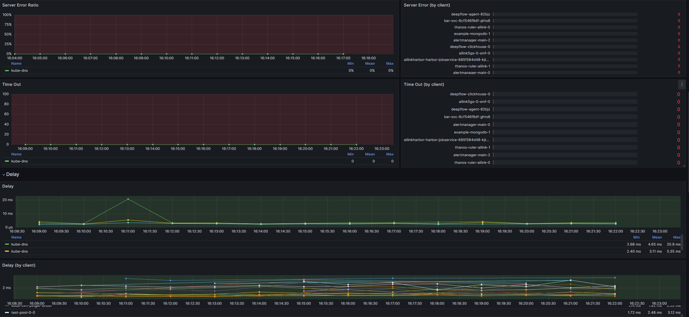

1. Application-Service List
此dashboard包含两个部分，分别是Service List和EndPoint List。展示了服务时延，请求速率，成功率等信息。
1.2 Service List

● Data Source： 数据源为DeepFlow
● auto_service： 筛选指定的service
● app_service:  筛选app_service
● signal_source: 筛选信号源
Auto Service
App Service
Signal Source
Request Rate
Delay Avg
Delay P75
Client Error Ratio
Server Error Ratio
对应k8s中service name

分为三种类型信号源：
Packet (cBPF)、eBPF、OTel来自不同信号源数据有细微差距。
请求速率 
平均时延
75%的请求时延时间段
客户端异常比例，通过客户端异常 / 响应计算得，即 client_error / response
服务端异常比例，通过服务端异常 / 响应计算得，即 server_error / response
1.3 Endpoint List

服务端点时延信息。
2. Application - Cloud Host
此dashboard主要以kubernetes节点的角度展示了请求成功率时延等信息。

● vm: 筛选指定节点
● protocol: 筛选指定协议
chost
Protocol
Request
Client error
Server error
Latency
云节点名
网络协议类型
请求速率
客户端错误百分比
服务端错误百分比
平均时延
3. Application - Cloud Host Map
此dashboard主要通过Map展示，当节点作为server，和当节点作为client两种角色情况下，请求时延，请求速率，客户端错误百分比，服务端百分比等信息。
3.1 当节点上服务作为服务端时：

3.2 当节点上服务作为客户端时：

4. Application - DNS Monitoring
该dashbord主要展示了dns协议请求信息，包括请求总数，客户端错误率，客户端错误数量，服务端错误率，服务段错误数量，DNS Topo，请求时延等等信息，可用于分析DNS解析相关错误。

4.1 Total Request、DNS Topo、Delay Distribution、Error

这部分面板展示了DNS请求总数，客户端及服务端错误数量和错误率，DNS亲求拓扑，在Client Error(by client)面板中展示了客户端错误数量列表。
4.2 Server Error Ratio、Time Out、Delay

这部分面板展示了DNS服务端错误百分比，服务端超时数量及按客户端统计列表；服务端时延，客户端时延等信息。
4.3 Request、Log Analysis、Request log Delay Distribution、Request Log

● Request: 展示DNS服务请求速率、客户端请求数量和所占百分比。
● Log Analysis: 展示请求日志数量列表，可按服务端、客户端、成功或错误进行筛选。如图展示了失败的DNS请求客户端和请求域名列表及对应数量，通过Request Log（by response desc）可以看出错误都是Non-Existent Domain。通过Request Log Delay Distribution可看出请求日志时延。Reqeust Log展示例如请求日志列表。
5. Dubbo Monitoring - K8S

Dubbo微服务监控。展示请求总数，服务连接，时延、错误、请求日志分析等内容。
6. Application - K8s Ingress

Ingress服务监控。展示请求、时延、错误、吞吐量等内容。
7. Application - K8s Pod
此dashboard展示了各个pod作为客户端和服务端发送请求的速率，错误率，时延等信息。

我们以部署的测试服务deepflow-ebpf-spring-demo为例：
● namespace: 筛选namespace为：deepflow-ebpf-spring-demo。
● workload：筛选工作负载。
● protocol：筛选网络协议。
7.1 Request面板
以redis-master-0 Redis为例，在此面板中可以看到名为redis-master-0的pod，网络协议Redis的最小请求速率（Min）为0.667 req/s, 平均请求速率（Mean）为1.26 req/s，最大请求速率1.33 req/s。
7.2 Server error面板
展示了各pod指定网络协议的服务端错误百分比。
7.3 Latency面板
展示了各pod指定协议时延信息。
7.4 Pod List面板
指定pod,指定协议的请求速率，客户端错误百分比，服务端错误百分比，平均时延列表。
8. Application - K8s Pod Map
此dashboard展示了pod请求map,请求速率，服务段错误百分比，客户端错误百分比，时延等信息。
我们以部署的测试服务deepflow-ebpf-spring-demo为例：
● namespace: 筛选namespace为：deepflow-ebpf-spring-demo。
● workload：筛选工作负载。
● protocol：筛选网络协议。
8.1 Show client

此时展示指定namespace中所有pod作为服务端时，相关client和server相关请求信息，包括请求速率，服务端错误率，请求时延。
8.2 Show server

此时展示指定namespace中所有pod作为客户端时，相关client和server相关请求信息，包括请求速率，服务端错误率，请求时延。
9. Application - Redis Monitoring - Cloud
此dashboard展示了集群redis的监控数据。包括同请求数量，客户端、服务端错误数量错误百分比，吞吐量，时延，服务拓扑、请求速率，客户端请求量列表、请求日志分析，TOP N 执行的redis命令等。

● Cloud Host: 按节点筛选redis服务
● IP: 按IP筛选redis服务
10. Application - Redis Monitoring - K8S
此dashboard展示了集群redis的监控数据。包括同请求数量，客户端、服务端错误数量错误百分比，吞吐量，时延，服务拓扑、请求速率，客户端请求量列表、请求日志分析，TOP N 执行的redis命令等。

● cluster： 筛选指定集群
● Redis Service: 筛选指定redis服务
● redis willdCard：通配符匹配
● Tap Side： 可选择不同的数据采集点，获取不同的指标，例如查看客户端网卡吞吐量，服务端网卡吞吐量等。
1.  Application - Request Log
此dashboard展示了请求日志相关数据。

● 筛选条件：可根据cluster（集群名）、namespace（命名空间）、workload（工作负载名）、protocol（网络协议）、request_type（请求类型）、reqeust_resource（请求资源）、status（响应状态）进行数据筛选。
● Summary count: 请求数量摘要。以一分钟区间统计请求数量。
● Error Count: 请求错误数量。
● Latency histogram: 请求时延直方图。
● Request log: 请求日志，包括Start time(请求开始时间)，Client(客户端)、Server(服务端)、Tap Side(数据采集点)、Protocol(网络协议)、App Protocol(应用协议)、Request type(请求类型)、Request domain(请求域名)、Request resource(请求资源)、Response Status(响应状态)、Response Code(响应码)、Response Delay(响应时延)。
1.  Application - Request Log - Cloud

此dashborad也是展示请求日志，与Application - Request Log展示内容相同，筛选条件不同：
● vm: 根据节点筛选
● protocol: 根据网络协议筛选
● request_type: 根据请求类型筛选
● reqeust_resource：根据请求资源筛选
● status：根据响应状态筛选
13. Application - SQL Monitoring - Cloud

此dashboar展示了mysql相关数据库监控信息。
● 筛选条件：可根据client(客户端)、DB Host(数据库所在节点)、DB IP(数据库IP)、Client For SQL Analysis（需要SQL分析的客户端匹配.
● 展示内容：请求总数、客户端列表、topo概览、客户端服务端错误百分比及错误数及列表、连接数、平均活跃连接数、时延、时延客户端列表、SQL执行分析（SQL Statement、Request Type、响应状态、时延、AffectedRows、执行数量）、吞吐量、分布式追踪、SQL语句时延列表。
14. Application - SQL Monitoring - K8S

此dashboar也是展示了mysql相关数据库监控信息。展示数据内容与SQL Monitoring - Cloud相同，筛选角度不同：
● client: 根据客户端筛选
● DB Cluster: 根据数据库所在集群筛选
● DB Service:  根据数据可服务筛选
● DB Wildcard: 根据数据库通配符筛选
● Tap Side: 根据数据采集点筛选
● Client For SQL Analysis：根据需要SQL分析的客户端匹配筛选
15. Distributed Tracing

此dashboard展示了分布式调用追踪，可选择一个调用进行例如点击Request中的_id，就会显示其调用的Flame Graph(火焰图)。Service List展示了调用在各个Service所花费的时间和百分比。Request Log展示了请求体制数据，Related Data展示了相关数据。
● N： 通过 BPF 从网络流量中提取的 Span
● S:  通过 eBPF 从系统或应用函数调用中提取的 Span
Span 是分布式跟踪的基本构建块。分布式跟踪中的单个跟踪由一系列标记的时间间隔组成,称为跨度。跨度表示完成用户请求或事务的逻辑工作单元。在分布式链路跟踪中有两个重要的概念：跟踪（trace）和 跨度（ span）。trace 是请求在分布式系统中的整个链路视图，span 则代表整个链路中不同服务内部的视图，span 组合在一起就是整个 trace 的视图。
16. Distributed Tracing - Cloud

此dashboard也展示了分布式调用追踪，与Distributed Tracing展示内容相同，筛选条件不同：
● vm: 根据节点筛选
● trace_id： 根据tarceID进行筛选，traceID是一个唯一标识符，用于跟踪整个分布式系统中的请求。它可以帮助我们追踪请求在整个系统中所经过的所有服务和操作，并且可以帮助我们在出现问题时快速定位问题。
● span_id：根据SpanID进行筛选，traceid 在请求的整个调用链中始终保持不变，所以在日志中可以通过 traceid 查询到整个请求期间系统记录下来的所有日志。请求到达每个服务后，服务都会为请求生成spanid，而随请求一起从上游传过来的上游服务的 spanid 会被记录成parent-spanid或者叫 pspanid。当前服务生成的 spanid 随着请求一起再传到下游服务时，这个spanid 又会被下游服务当做 pspanid 记录。
● request_resource：请求资源。
17. Network - Cloud Host

此dashboard展示了各节点网络性能指标。可根据Vm(节点)进行筛选。
● Throught(bps): 展示了节点吞吐量，包括最小值、平均值、最大值。
● Retrans rate: 展示包重传率，包括最小值、平均值、最大值。
● TCP conn. establishment fail rate: TCP连接建立失败率，包括最小值、平均值、最大值。
● TCP conn. establishment latency：TCP连接建立延迟指的是从客户端向服务器发起TCP连接请求，到服务器成功响应这个请求并建立起TCP连接所需的时间。这个延迟时间通常由网络延迟、服务器处理能力和其他因素决定。在高性能网络和服务器环境中，TCP连接建立延迟应该尽可能低。如果延迟时间过长，可能会导致用户体验不佳或者网络应用程序性能下降。
● Cloud Host List：展示节点网络性能详情列表。
chost
Throughput(bps)
Throughput(pps)
TCP new conn.
TCP retrans rate
TCP conn. establishment fail rate
TCP conn. establishment latency
TCP/UDP data latency
节点名
是吞吐量的单位，表示每秒传输的比特数（bits per second）
是网络吞吐量的一种单位，表示每秒发送的分组数据包数量
TCP新建连接数
包重传率
TCP连接建立失败率
TCP连接建立延迟
TCP或UDP协议下数据传输的延迟时间。
TCP/UDP data latency指的是TCP或UDP协议下数据传输的延迟时间。这是从数据发送端到接收端的时间，包括在网络中传输以及在发送和接收端的处理时间。这个延迟可能会受到网络拥堵、硬件性能、协议效率等因素的影响。一般来说，低延迟的通信对于实时性要求高的应用非常重要。
18. Network - Cloud Host Map
此dashboard展示了各节点，网络性能拓扑图。可根据VM(节点)，进行筛选。
18.1 Show Client

展示了指定节点作为服务短时，网络性能指标，通过拓扑图可以点至查看指定客户端服务端之间的数据传输速率。
在Cloud Host Path列表中展示的数据与Network - Cloud Host相比多了以下数据：
● CLient: 客户端名。
● Server: 服务端。
● Tap side: 数据采样点。
● Protocol: 网络协议。
● Server port: 服务端口。
18.2 Show Server

与show client展示内容相同，角度不同，此时展示当指定节点作为客户端时相关网络性能指标。
19.  Network - Flow Log

此dashboard展示了网络流日志内容。
可根据cluster(集群)、namespace(命名空间)、workload(工作负载)进行筛选。
● Summary count: 日志总量摘要。
● Error count: 错误数量。
● TCP est.conn latency distribution：连接建立（establishment）延迟时间分布。
● TCP data latency distribution： 指的是在TCP协议下，数据传输延迟时间分布。
● Flow log：网络流日志列表，内容包括 start time(开始时间)、client(客户端)、server(服务端)、tap side(数据才采集点)、protocol(网络协议)、client port(客户端端口)、server port(服务端端口)、status(状态，由 close_type（流结束类型）与 protocol（协议）决定：正常结束/周期性上报/非TCP超时=正常，客户端XX=客户端异常，服务端XX/TCP超时=服务端异常，其他结束方式=未知。)、Byte TX(发送字节数)、Byte RX(接收字节数)、TCP Client Retransmission(TCP客户端重传)、TCP Server Retransmission(TCP服务端重传)、Avg TCP Est. Delay(连接建立平均时延)、Avg Data Delay（数据传输平均时延）。
20. Network - Flow Log - Cloud

此dashboard展示的网络流日志内容与Flow Log相同，区别是筛选条件不同，此dashboard提供根据VM(节点)进行筛选，查看各节点上工作流日志。
21. Network - K8s Pod

此dashboard展示了pod的网络性能相关指标，可根据cluster、namespace、workload进行筛选。
● Throught(bps): 展示了pod网络吞吐量，包括最小值、平均值、最大值。
● Retrans rate: 展示pod包重传率，包括最小值、平均值、最大值。
● TCP conn. establishment fail rate: TCP连接建立失败率，包括最小值、平均值、最大值。
● TCP conn. establishment latency：TCP连接建立延迟。
● Pod List： pod网络性能列表。
22.  Network - K8s Pod Map

网络性能全景图，点击路径可查看相关指标，包括bps、retrans_ratio(TCP 重传比例：TCP 重传比例，通过TCP 重传 / 所有的包计算得，即 retrans / packet)、tcp_establish_fail_ratio（建连-失败比例：建连-失败比例，通过 TCP 建连-失败次数 / 所有的关闭连接计算得，即 tcp_establish_fail / close_flow）、rtt(平均 TCP 建连时延,统计周期内，所有 TCP 建连时延的平均值)、art(平均数据时延:统计周期内，所有数据时延的平均值，数据时延包含 TCP/UDP)等。