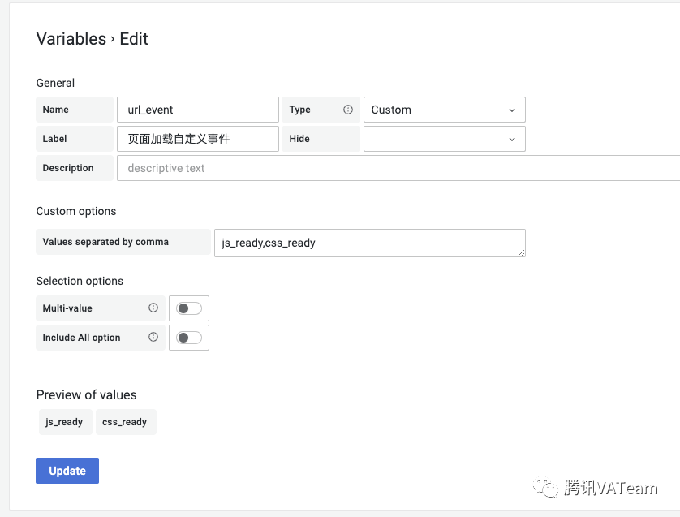

看完这篇，成为Grafana高手
原创 huhuli 腾讯VATeam 2022-09-30 14:08 发表于广东
https://mp.weixin.qq.com/s/ZhBlCjJVhm0dDSCrJFGtfQ
# 背景

QQ直播前端团队接入腾讯云前端性能监控（RUM）后，对目前的监控能力以及上报数据进行了梳理， 并着手进行了前端性能监控的专项建设，其中监控数据大盘建设是不可或缺的一环。
可视化的监控大盘可以清晰明了的观察到各项目运行情况，宏观上能快速进行项目间的横向对比，也可以非常便捷的进行项目各数据维度的详细展示，纵向的分析各指标数据的统计。


通过对数据大盘支持能力的调研，我们采用Grafana进行了数据大盘的建设。通过搭建Grafana服务，然后添加监控上报数据，最终使得【QQ直播前端监控数据大盘】得以建设完成。


那么什么是Grafana？

Grafana 是一款开源的数据可视化工具，使用Grafana可以非常轻松的将数据转成图表(如下图)的展现形式来做到数据监控以及数据统计。

         

Grafana官方提供Linux，Windows，MacOS，Docker版本

下载链接:  https://grafana.com/get/


本文将依托建设数据大盘的经验，重点介绍一下Grafana的使用，助力小伙伴们成为Grafana高手。


# 数据与图表

数据的可视化都是通过图表为载体的，不同的图表可以将数据进行不同侧重点的展现，要进行数据大盘的建设，首先要对图表有一个简单的了解，这样才能在数据大盘搭建过程中选择合适的图表，合理的进行可视化效果的展示。


认识Grafana的图表
✦

Grafana 的图表的选择路径都是 在 Visualization 类目下进行图表的选择

                


## 1. 折线图

           

示例图表：Time series

图表配置：Graph styles

a. style: Lines

b. Fill opacity: 3

c. Gradient mode: scheme


## 2. 柱状图

         

示例图表：Time series

图表配置：Graph styles

a. style: Bars

b. Fill opacity: 3

c. Gradient mode: scheme


## 3. 点状图

        

示例图表：Time series

图表配置：Graph styles

a. style: Points

b. Point size: 5

c. Stack series: Normal


## 4. 饼状图

          

示例图表：Pie chart


## 5. 单一状态图

          

示例图表：Stat

图表配置：Graph styles

a. style: Bars

b. Fill opacity: 3

c. Gradient mode: scheme


## 6. 仪表盘

        

示例图表：Gauge


## 7. 表格

         

示例图表：Table


## 8. 文本

           

示例图表：Text（支持Markdown 和 HTML两种格式）


## 9. …


# 数据与图表的搭配

## 按照数据格式区分
✦

柱状图， 折线图， 饼状图的图表都需要数据具有时间序列，用于展示在一定的时间区间或者是连续的时间范围内，单一数据或者多种分类数据的变化趋势，或者是数量占比。


状态图， 表格数据，仪表盘等则对数据没有时间序列要求，状态图，仪表盘可用于进行一些总结性的数据展示，例如速度，温度，进度，完成度等， 表格数据则更适合展示复杂数据或者多维度数据


## 按照使用意图区分
✦

数据比较：柱状图，折线图比较合适，可以实现单数据，多种类数据的比较，能清晰看到变化趋势


占比分类：饼图，仪表盘， 单一状态图等比较合适，可以清晰的看到每个数据整体性的占比


趋势比较：折线图，面积图(折线可设置覆盖面积) 等比较合适，能直观展现数据变化


分布类：饼图， 散点图 等比较合适


## 其他      ✦
文字类图表就如同名字含义一样，可用于展示文字相关信息，并且个性化定制程度，灵活性排布支持都非常高（得益于Markdown 和 HTML的强大灵活性）


表格对于日志类型，或者是其他多维度数据展示较为合适，适用于整体性给出一个报表，并且具备排序等公共功能，方便数据快速比较。


## 数据与图表的添加与扩展

数据源与图表的扩展Grafana都采用插件的形式，因此我们想要扩展某个类型的数据源或者图表时，都需要先在Grafana插件市场找到目标插件，然后进行安装，如下图代码

```
FROM grafana/grafana:8.3.1
USER root
RUN grafana-cli plugins install grafana-clickhouse-datasource //数据源插件
RUN grafana-cli plugins install auxmoney-waterfall-panel //图表插
```


## 数据源添加
✦

打开Grafana平台，点击左侧"设置"图标，进入DataSource管理面板。

               

在“Add data source"面板中选择合适的数据源，并配置数据库信息。下图以Promethrus为例，添加数据源需要进行必要的配置，例如数据源的ip，port以及鉴权信息等。

         

        


## 图表插件添加
✦

1. 打开Grafana平台，点击左侧"设置"图标，进入Plugins管理面板

           


2. 在tab 栏筛选已经安装的插件，就可以看到已经安装可以使用的插件

           


3. 图表面板已经安装，可以直接在创建面板的时候指定类型使用

       


# Grafana入门使用

这里需要区分两个概念：

看板（dashboard）: 一个或多个数据图表形成的集合

面板（panel）：组成看板的其中一个图表


## 创建一个看板 (dashboard)
✦

创建一个数据可视化看板的前提是需要有数据源的接入， 具体具体接入方法见数据与图表的添加与扩展


1. 打开Grafana平台，点击左侧"加号"，点击Create类目下的Dashboard 按钮，新创建一个空表的看板， 会默认弹出四个添加panel的选项        


a.添加一个空白面板

b. 添加一个新的行，用于面板的分类

c. 从面板库添加一个面板

d. 从剪贴板添加一个面板，可以用来快速复制一个已有的面板


2. 点击看板右上角保存看板。        

a. 输入看板名称

b. 输入简单描述文字

c. 选择看板所属目录（用来分类管理看板）

d. 可选为看板设置Tag，标记看板的特征，后期可根据Tag来筛选看板

e. 其他选项可按需自主定义


## 创建面板 (panel)
✦

         

点击上图所示的图表，会弹出创建面板的四种选择，可以根据自己的需求自主创建，下面我们以创建空白面板为例

点击Add a new panel 按钮， 你就会创建一个空白数据的图表面板，如下图

   

         

## 面板数据的获取
前文已经提到， 创建一个数据可视化看板的前提是需要有数据源的接入，因此，我们想要获取数据，必须要进行数据源的接入

1. 选择数据源（Data source）

        配置选择自己接入的数据源后，后续才能进行相关数据获取的语法编写，这里不同的数据源之前需要的语法也不一样，因此大家可以自己根据自己的条件自主选择， 因为QQ直播接入的数据源是influxdb, 因此后面的例子将会以influxdb语法为例。


2. SQL语句的编写

Grafana的面板语法编辑有两种形式， 简易模式与高级模式

Grafana 一个面板支持多条SQL语句


a. 简易模式：简易模式数据的获取主要通过下拉框的形式选择具体的指标以及判断条件， 支持添加多个条件

   

高级模式：通过点击编辑图标可以进行编辑模式的切换，高级模式下为全部的SQL语句的编书写，此模式对于语法有一定的要求，但是获取数据会更加的灵活


## 面板的基础配置
在编辑完成数据获取的SQL语句之后，面板上应该已经有了相关数据的展示，此时可以根据自己的数据格式，以及展示诉求来选择对应的图表，图表具体选择参考上文数据与图表的搭配


我们以默认的Time series的折线图为例，简述一下面板的基础配置


1. 面板的基础信息

      

在通过SQL语句选择加载完成数据后，图表会有默认的样式给到我们，此时如果对面板无其他要求，只需配置一下面板的基础信息就可完成Grafana的看板配置

基础信息包括

a. 标题

b. 描述

c. 背景是否透明


2. 数据提示

        

Tootip配置项用于配置当鼠标经过（hover）图表数据点的时候的提示信息， 可选为Single单个提醒， All显示所有数据， Hidden都不显示

         


3. 图例（legend）显示设置

         


图例显示模式有三种

a. List (默认)， 图例数据横向依次展示

b. Table， 图例数据会按照表格形式展示

c. Hidden, 不展示图例


图例的位置

a. Bottom, 陈列在图表底部

b. Right, 陈列在图表的右侧


 图例值展示

      

此处会有一个下拉列表供我们选择图例的显示数据，默认不展示，用户也可以选择数据展示形式，例如最大值，最小值，平均值等


4. 坐标轴（Axis）配置

         

坐标轴的基础配置一般只需要设置一下坐标轴的名称（Label）即可，其余的设置可以按照默认值不用修改，下面简述一下配置的含义

a. Width选项可以选择设置坐标轴（Label）的占比宽度

b. Soft min 以及 Soft max 用来设置纵坐标的显示的最大值最小值

c. Show gride lines 可以设置是否显示背景的网格线

d. Scale 用来设置是否进行数据的放大，目的是让数据对比更加清晰


通过以上对一个图表面板的基础配置，我们的一个图表基本上已经成型，可以达到数据可视化的正常显示目的，剩下的就是加强对自己数据格式类型的分析以及基于自己的可视化诉求来进行合适的图表面板的配置选择，就可以通过多个图表的添加来完成自己初版的数据可视化看板。


# Grafana进阶使用

当我们选择一个图表插件进行数据可视化的时候，图表的一些属性会帮我们设置好了默认值，但是基于兼容性更广的特性，这些默认值也许并不是我们选择图表最合适的展示效果，因此为了进一步提升图表的展示性，我们可以通过以下属性来进行面板的进一步美化。


## 图表属性配置 (Standard options)
✦

              

此选项框中的属性配置，可以使得我们的数据展示更加的准确，例如纵坐标的单位，我们不想采用通用意义上的在Label上进行命名标注单位例如耗时（ms）, 那么就可以选择此处的单位属性（Unit）进行更精确的展示


1. 单位（Unit）

              

在单位选项中， 你可以进行非常精细化的选择，选项框中几乎包含了所有品类用到的单位属性，例如百分比，长度单位，时间单位，角度单位等等


2. 显示范围（Min, Max）

在Min, Max 选项中，允许用户输入一个数字进行显示范围的限制，那么图表上在显示范围之外的数据将不会在图表中显示，例如我将耗时限制在0~3000范围，那么3000以外的数据将会被隐藏

               


3. Decimals 选项可以用来设置纵坐标数据的小数点范围


4. Display Name 选项则可以用来设置图例显示名字，但是由于限制，只能在只有一类数据时比较适用，如果数据类别较多，单纯在此处设置会将全部图例数据覆盖，因此图例的名称最好在SQL语句编写的时候就做好展示。当然后面也会讲有别的方法进行多种图例数据别名的单独设置


5. 图表颜色配置（Color scheme）

一般图表颜色的展示都会有默认值，不过我们想要改变现在图表曲线的颜色分类可以在此处进行设置。

               


我们可以选择整体图表的颜色走向或者是颜色分布，但是一般曲线展示的颜色还是会根据数据自己适配，因此如果我们想要改变某一条曲线的颜色，可以直接点击图例前面的颜色icon,进行颜色选择。我们可以根据提供选项进行选择，也可以自定义设置颜色。


                

## 阈值设置 (Thresholds)
✦

有些图表插件是支持设置阈值的， 阈值的设置可以使得我们对数据的合规程度有清晰的对比，能够直观的衡量出当前数据的质量，因此阈值设置也是面板美化展示的一个重要部分


              


如上图示例，我们设置对耗时的图表设置了两个阈值，上图的意义是：

* 在3000ms和5000ms设置阈值

* 3000ms以下将视为健康，颜色标记为绿色

* 3000ms~5000ms视为亚健康，颜色标记黄色

* 5000ms以上视为警示，颜色标记为红色


阈值的模式有两种选择

1. 绝对值, 即按照标记的阈值数据进行比较

2. 百分比, 阈值为相对于最大值的占比


阈值展示的形式有四种：

1. 不展示 （off）

2. 只展示阈值线 （as lines）

3. 只展示区域 （as filled regions）

4. 同时展示阈值线和区域 （as filled regions and lines）


下图为我们选择绝对值模式下，展示线和区域的阈值示例图， 由图可以看出数据在不同阈值区间的分布，以及与阈值的对比，因此我们能直观的评估出数据的质量


            


## 数值映射 (Value mappings)
✦

            

图表的展示都是由许多的值来组成的一个个点，连线，反过来讲，图表就是数据值的展现，在图表中， 有时候有些数据并不是我们理想的数值，或者说我们想特异性的让某些值显示为其他值（写SQL语句也可以实现）， 这时候可以使用数值映射选项


               

数值映射的形式可以有以下四种

1 单纯的某个值映射

2. 一段范围区间映射

3. 正则表达式映射

4. 针对某类值映射


例如在示例中，假如我们健康波段数据具体值不关心， 只是关心整体的数据波动范围是否在健康范围之内，我们可以把0~3000ms的范围映射为健康，那么再具体显示的时候，不再会有具体值给到我们，统一会展示健康，如下图：

               


这个功能更加适用于表格数据，例如我们明确的将空数据映射为空或0的场景，如下图

               


## 数据覆盖 (Overrides)
✦

数据覆盖允许我们对之前已经设置好的图表进行个性化设置，它相当于图表更高级的设置，覆盖的范围可以是整个SQL语句获取的数据，也可以是数据中某一类图例数据

         

具体覆盖的数据类别：

1 某一类数据

2. 正则匹配到的数据

3. 某些类型的数据

4. 整个SQL查询的数据


在设置了一个Override 之后，就可以进一步进行子项的配置，子项里面的属性几乎与上文介绍的图表属性一致

          

我们通过覆盖属性的配置，可以让修改到之前我们已经在整体设置好的图标样式


例如我们现在经过SQL查询，已经获取到了js_ready和css_ready的耗时数据，但是我们想让这两种数据对比更加明确，既能够清晰的看到整体的趋势，也能看到某类数据单独的变化，这时我们可以通过override属性进行配置，让两个数据的纵坐标分别在左右两边，并且数据展示用折线和柱状图分别表示。


具体override配置属性如下图：

              


对css_ready 数据配置：

1. 图表展示为柱状图， 柱状图数据点居中

2. 纵坐标数据靠右展示，颜色为浅绿色

3. 标题设置为CSS耗时（ms）


对js_ready数据配置：

1. 默认基础配置折线图

2. 默认纵坐标靠左展示

3. 设置颜色红色

4. 标题设置为JS耗时（ms）


最终结果如下图：                         


## 变量与模板
✦

在Grafana里面，学会使用变量，会发现打开了新世界的大门，用好变量，可能你的工作量就会缩减一半，甚至更多。


变量的使用场景有很多，例如我们编写SQL语句中的时间选项（$__interval），就是内置的一个变量，通过这个时间变量，可以控制多个图表在不同时间范围内的展示情况，因此一个好的变量的使用，可以让我们只配置一个图表，达到展示不同条件下的数据的目的，而不用去为每一种情况设置一个图表。


模板在Grafana中最简单的含义就是任何一条包含变量的查询（query)。


【变量的设置】

变量的设置是基于看板的，看板内设置的变量，对看板内的所有面板是共享的

点击看板设置，进入变量设置页面

               


            


【变量的种类】

               


在添加一个变量的可选下拉框中，可以选择添加的变量类型，共计有以下几种变量可以选择


|变量类型  |      描述|
|:-----|:-----|
| query | 查询变量允许编写可以返回指标名称、标签值或键列表的数据源查询。例如，查询变量可能会返回服务器名称, ID 或数据中心的列表。变量值随着数据源查询动态获取选项而变化。|
|custom | 手动定义变量选项,使用逗号分隔的列表|
|text box| 显示具有可选默认值的自由文本输入字段|
|constant|设置一个常量|
|data source|快速添加一个数据源的变量|
|interval|代表时间跨度的变量|
|ad hoc filters|自动添加到数据源的所有指标查询的键/值过滤器（仅限 InfluxDB、Prometheus 和 Elasticsearch）|


添加变量的其他输入框选项可以直接根据英文的意义非常直白的看出，例如设置面标签信息，描述信息，以及设置是否在看板中隐藏，对于某些变量类型还可以设置是否可以多选或者是否包含所有的值的选项等等，这些设置可以根据自己的需求来选择。


【变量的使用】

设置完成变量之后，变量的使用有两种形式

$varname， 这是最直接的方式， 但是这种语法会有限制，就是不能在一个词的中间使用例如：apps.frontend.$varname.requests.count

1. ${var_name}， 如果想要在表达式中间插入变量，请使用此语法，另外这种语法还有一些高级用法，${var_name:<format>}，这种格式可以更好地控制 Grafana 如何插入值，具体的用法可以参考官方文档


【变量简单使用示例】

沿用上文的数据，我们创建一个简单的自定义变量，url_event,如下图

               



获取数据的时候,sql 语法就可以写成如下

               


这样，我们只建立了一个图表面板，由于使用了变量，因此可以只用变量的切换就实现看板数据的变化，如下

变量选择 js_ready

变量选择css_ready


## Link的使用
✦

在Grafana中，可以使用链接来进行看板的跳转以及外链的跳转，并且link的使用也非常灵活。

在一个数据面板的设置中，link可以的设置主要有两种方式


1. 整个面板设置链接

              


在数据面板的设置中，前文我们没有细讲link的选项，这里其实是为整个数据面板设置跳转链接的入口，通过此处设置link，可以在面板上增加一个icon, 实现我们在点击的时候进行跳转, 具体效果如下图

              


2. 为具体数据设置link(data links)

data links属性设置一般只在柱状图、折线图、表格面板里才有，并且，如果没有搭配override属性进行个性化设置的话，默认每个数据点都会设置上跳转的链接，效果如下图

               


这样的设置其实和整个面板设置link类似，因此不同的data links 最好和override属性搭配，来进行个性化的数据链接跳转，以达到不通数据跳转不同链接的目的。


## Link与变量的搭配
✦

Grafana的link设置非常灵活，在link设置中，可以直接使用已经设置的看板变量以及系统的变量来进行链接的组合。


甚至在data links的设置中，还可以直接使用SQL语句查询到的结果来进行链接的组合，这样也可达到不同数值设置不同的跳转链接的功能


在添加链接的时候，如果想查看可用变量列表，可以直接在数据链接URL字段中键入 $ 来查看变量列表，效果如下图：

               


变量列表里的变量主要可以分为三个类型

a. 全局内建的变量，例如时间变量的 from, to

b. 用户创建的模板变量，例如上文示例创建的 url_event

c. 基于SQL语句查询出来的数据，一般都在fields字段下


通过引用变量来创建图表面板的跳转链接，可以较为灵活的实现基于数据的外链跳转以及更为高级的数据看板的之间的联动，下文要讲到的数据下钻就是基于data links 与变量的搭配来实现。


# Grafana高级使用

## 妙用Transform
✦

前面讲的一些Grafana的使用，都是以SQL语句查询到的数据为基础，在图表可视化上进行的设置与操作，而Transform的功能，大部分是更底层的操作，直接对数据的操作，来达到改变图表展示的目的，是数据可视化之前的操作。

tranform 可以实现将我们查询到的数据进行进一步加工，例如可以进行数据筛选，计算，重命名，排序以及控制隐藏等功能。

               


本文以几个较为典型的功能简单介绍一下

1. 通过计算添加数据（Add field from calculation）

              


数据的计算有两种模式：

a. Reduce row： 分别对选择的特定字段数据的每一行进行聚合计算

b. Binary option： 选定的两个字段的值进行数学运算例如加减乘除


2. 转换数据的类型(Convert field type)

可以将选择的特定字段的值的类型指定为固定的数据类型

              


3. 根据名称筛选数据展示(Filter data by name)

a. 可以将SQL语句查询出的字段名称陈列，并且自定义数据的展示与否

b. 也可以直接根据正则表达式进行数据筛选

               


4. 数据合并（Merge）

类似sql中的join，根据时间序列来进行合并不同的字段数据成为个数据表

               


5. 重命名（Rename by regex）

可以使用这个功能来进行查询结果名称的转换，允许我们使用正则表达式来进行重命名内容的匹配

          

transform 还有很多实用的功能，这里就不一一陈列，如果有需要用到操作数据的功能，可以考虑transform功能，全部的功能可以直接看官方文档


## 面板的Repeat
✦

面板的repeat 也是需要搭配变量功能来使用，图表面板会根据用户选择的变量个数来进行分别加载，因此，此功能使用的前提是变量的值要大于1个，并且设置了允许多个变量可选，见下图示例

               


当前提条件满足后，可以在面板的repeat属性进行设置

               


repeat 可选加载的方向是横向还是纵向，并且可以设置最大的重复个数，来避免造成加载展示问题以及性能问题。


当设置完成后，并不会马上生效，需要保存然后退出此图表面板然后重新加载一下数据看板，然后数据图表就会根据我们选择的变量的个数来进行分别的展示。

以上文的示例设置之后，效果如图：

               


## 数据下钻
✦

要实现一个数据下钻，需要link搭配变量来进行看板之间的联动，主要的思路大体如下：

1. 模板看板B中设置好需要的变量

2. 模板看板B查询数据时引用变量

3. 在源图表面板A中设置跳转到模板看板B的链接，链接上引用我们设置或者是查询的变量内容

4. 跳转至目标模板数据看板B时，模板看板B获取从link上带过来的变量值

5. 变量赋值，模板看板B根据变量值刷新数据查询


经过上面的步骤，那么一个数据看板之间的联动就完成了，剩下的步骤就是丰富变量的设置以及看板内图表面板的内容了。


那么如何从跳转过来的link上获取到携带过来的变量的值呢？


在上文我们设置变量来控制数据面板repeat的时候，我们设置了一个变量 url_event

当控制变量为 js_ready的时候，看板的整体URL是
        


当控制变量为 css_ready的时候，看板的整体URL是

               


因此我们可以看到，当我们看板设置变量并且使用的时候，变量的内容是以query的格式显示在URL上的，并且命名的格式如下：
```
var-{your_var_name} = {your_var_value}
```

当变量在url上面显式的标记的时候，Grafana会主动获取链接上面声明的变量的值并赋值给模板变量。


因此根据上面的格式，我们可以在link上面构造上述的数据query格式，为模板的看板变量赋值。


于是实现一个的数据下钻整体流程都变得清晰了，下面我们还是以上文的例子来构造一个简单的数据下钻的例子


1. 构造一个整体的page render 数据看板 A

将数据格式以table的形式展现，整体性的展示当天项目的render过程的各个事件平均耗时情况，如下图：

               


2. 设置一个详细指标数据的模板看板 B

新建另一个数据详情的看板，然后建立一个事件的变量

               


编写具体事件详细数据的查询SQL语句，并引用变量

               


3. 通过link实现看板之间的联动

配置数据看板A的data link, 使得每一行数据可以进行下钻详情展示

               


经过上述步骤，就完成可一个简单的数据下钻，实现可一个项目page render过程的整体数据的可视化，并且可以点击具体加载事件查看该事件详细的数据分布趋势

效果如下:


## 总结

Grafana是一款非常优秀的开源可视化工具，能非常方便的将数据进行可视化，非常适合数据大盘建设，以及做数据监控和数据统计的工作。

本文基于实际业务中建设监控数据大盘的经验，介绍了Grafana基本的一些图表概念和使用方法，并对不同的数据类型选取合适的可视化图表提供了一些建议和思考。

通过三个阶段的介绍，总结了Grafana进行数据可视化入门教程以及一些进阶使用技巧，希望能在未来你的业务中，数据大盘的建设过程中提供一些便利和思路。