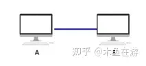
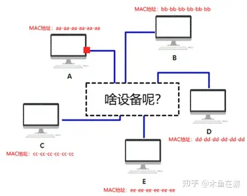
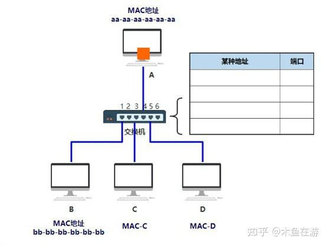
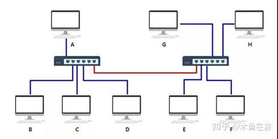
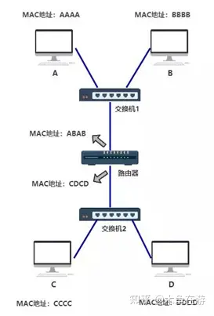
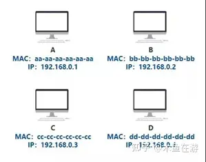
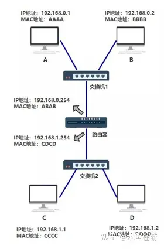
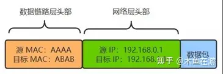
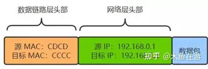

计算机被发明出来使用很长时间，都是作为一个独立的个体来使用的，直到后来美国国防部的高级研究计划局（ARPA）计划建设一个军用网，叫做“阿帕网”（ARPAnet），阿帕网于1969年正式启用，当时仅连接了4台计算机，供科学家们进行计算机联网实验使用，直到那时候才开始出现计算机网络的概念。

今天我们就来聊聊计算机组网的那点事儿

第一层（物理层）

从计算机组网的角度来说，将两台计算机通过网线相连，就是一个简单的网络结构，如图所示：

但是在实际网络环境中，接入网络的计算机不可能只有两台，那么在有很多台计算机的情况下，我们该如何连接呢？

为此我们发明了一个中间设备，将计算机的网线都插到这个设备上，由这个设备做转发，这样彼此之间就可以通信了。

这个中间设备的名子就叫集线器（俗称HUB）,它的功能非常简单，仅仅是将任意一个接口接受到的电信号转发到所有出口（广播），不做任何处理，因此将他定位为物理层设备。

但是这种转发方式会引起一个新的问题，由于转发到了所有出口，那接在集线器下的其他设备都能接受到数据，那么怎么判断数据是不是发给自己的。

这儿就引入一个新的名词，MAC地址，正常情况下MAC地址是全局唯一的标识，全世界独一无二，给每一个设备都配一个MAC地址，这样，A 在发送数据包给 B 时，只要在头部拼接一个源目MAC地址就可以解决此问题了。B 在收到数据包后，根据头部的目标 MAC 地址信息，判断这个数据包的确是发给自己的，于是便收下。其他的计算机收到数据包后，根据头部的目标 MAC 地址信息，判断这个数据包并不是发给自己的，于是便丢弃。虽然集线器使整个网络布局简单明了，但会出现一个新的问题，原来我只要发给电脑B的消息，现在却要发给连接到集线器中的所有电脑，这样既不安全，又浪费宝贵带宽资源。

第二层（数据链路层）

在第一层中，我们最后虽然解决了多台计算机的组网需求，但最后却留下了问题，即集线器的使用不仅有安全隐患，而且浪费有限的带宽资源。那第二层的主要目标就是解决安全隐患以及带宽浪费的问题，把这个集线器弄得更智能一些，想要将数据发送到那一台设备，就只发给目标 MAC 地址指向的那台电脑，就好了。

所以一个全新的设备出现了，这东西就叫做交换机。它能够实现你将数据发送到指定的设备而不会转发到所有出口（广播）的情况，因此将他定位为数据链路层设备。每一台交换机内部维护一张 MAC 地址表，记录着每一个设备的 MAC 地址，连接在其哪一个端口上。

|MAC 地址|	端口|
|:------|:------|
bb-bb-bb-bb-bb-bb|	1
cc-cc-cc-cc-cc-cc|	3
aa-aa-aa-aa-aa-aa|	4
dd-dd-dd-dd-dd-dd|	5

这种情况下，假如你仍然要发给 B 一个数据包，构造了如下的数据结构从网口出去。

到达交换机时，交换机内部通过自己维护的 MAC 地址表，发现目标机器 B 的 MAC 地址 bb-bb-bb-bb-bb-bb 映射到了端口 1 上，于是把数据从 1 号端口发给了 B，一次数据转发完成。而以这样传输方式组成的小范围的网络，叫做以太网。当然刚开始的时候，MAC 地址表是空的，那MAC地址表是如何建立起来的呢？假如刚开始交换机 MAC 地址表是空的，你给 B 发送了如下数据：

由于这个包从端口 4 进入的交换机，所以此时交换机就可以在 MAC地址表记录第一条数据：

|MAC 地址|	端口
|:------|:------|
aa-aa-aa-aa-aa-aa-aa|	4

交换机看目标 MAC 地址（bb-bb-bb-bb-bb-bb）在地址表中并没有映射关系，于是将此包发给了所有端口，即广播发送。之后，只有机器 B 收到了确实是发给自己的包，于是做出了响应，响应数据从端口 1 进入交换机，于是交换机此时在地址表中更新了第二条数据：

|MAC 地址|	端口|
|:------|:------|
aa-aa-aa-aa-aa-aa-aa|	4
bb-bb-bb-bb-bb-bb|	1

经过该网络中的机器不断通信，交换机最终将 MAC 地址表建立完毕~

最直观的展示过程：

通过此种方法我们就成功的建立了一个相对安全，也比较智能的局域互联网络，通过此网络我们可以在几台计算机之间分享数据，但是很快新的问题又出现了。随着机器数量越多，一台交换机的端口不够了，我们能想到的最简单的办法，就是将多个交换机连接起来，解决这 个问题，事实上还真的可以，但是这样真的没有问题吗？

需要注意的是，上面那根红色的线，最终在 MAC 地址表中可不是一条记录，而是要把 EFGH 这四台机器与该端口（端口6）的映射全部记录在表中。最终，两个交换机将分别记录 A ~ H 所有机器的映射记录。

左边的交换机

|MAC 地址|	端口|
|:------|:------|
bb-bb-bb-bb-bb-bb|	1
cc-cc-cc-cc-cc-cc|	3
aa-aa-aa-aa-aa-aa|	4
dd-dd-dd-dd-dd-dd|	5
ee-ee-ee-ee-ee-ee|	6
ff-ff-ff-ff-ff-ff|	6
gg-gg-gg-gg-gg-gg|	6
hh-hh-hh-hh-hh-hh|	6

右边的交换机

|MAC 地址|	端口|
|:------|:------|
bb-bb-bb-bb-bb-bb|	1
cc-cc-cc-cc-cc-cc|	1
aa-aa-aa-aa-aa-aa|	1
dd-dd-dd-dd-dd-dd|	1
ee-ee-ee-ee-ee-ee|	2
ff-ff-ff-ff-ff-ff|	3
gg-gg-gg-gg-gg-gg|	4
hh-hh-hh-hh-hh-hh|	6

这种设计方式，在计算机数量不多的情况下是可以正常使用的，但是当接入的计算机数量太多，交换机就无法维护如此巨大的表了。

第三层（网络层）

在第二层中问题的根本在于，连出去的那根红色的网线，后面不知道有多少个设备不断地连接进来，从而使得地址表越来越大。

解决的办法就是，再接入一个新的设备，这个设备有自己独立的 MAC 地址同时还能把所有流经的数据包做一次转发，这个设备就是路由器，并将它定在了网络层。现在交换机的 MAC 地址表中，只需要多出一条 MAC 地址 ABAB 与其端口的映射关系，就可以成功把数据包转交给路由器了，而后由路由器转发到其他设备。但是这儿由出现了一个新的问题，那就是如何做到将发送的数据先发送给路由器呢？

为了解决这个问题，我们又发明了一个新的工具，IP 地址。现在每一台电脑，同时有自己的 MAC 地址，又有自己的 IP 地址，只不过 IP 地址是软件层面上的，可以随时修改，MAC 地址一般是无法修改的。这样一个可以随时修改的 IP 地址，就可以根据你规划的网络拓扑结构来调整了。

如上图所示，假如我想要发送数据包给 ABCD 其中一台设备，不论哪一台，我都可以这样描述，"将 IP 地址为 192.168.0 开头的全部发送给到路由器，之后再怎么转发，交给它！那交给路由器之后，路由器又是怎么把数据包准确转发给指定设备的呢？

我们先给上面的组网方式中的每一台设备，加上自己的 IP 地址

现在两个设备之间传输，除了加上数据链路层的头部之外，还要再增加一个网络层的头部。假如 A 给 B 发送数据，由于它们直接连着交换机，所以 A 直接发出数据包即可，网络层的功能没有体现出作用。但假如 A 给 C 发送数据，A 就需要先转交给路由器，然后再由路由器转交给 C。由于最底层的传输仍然需要依赖以太网，所以数据包是分成两段的。

A-路由器这段的包如下：

路由器-C这段的包如下：

A 给 C 发数据包，首先判断源 IP与目的IP是否处于一个子网，如果处于同一个子网，直接将包通过交换机发出，如果源 IP 与目的 IP 不处于一个子网，就交给路由器去处理，这里又有一个新的问题，那就是A 如何知道，哪个设备是路由器呢？答案就是你提前需要在 A 上设置路由器的地址，而这个地址我们叫他默认网关。现在数据已经可以成功发到路由器这里了，最后一个问题就是，路由器如何知道，收到的这个数据包，该从自己的哪个端口出去，才能直接（或间接）地最终到达目的地 C 呢。

这儿就又出现了一张新的表，叫做路由表。至于这个路由表是怎么出来的，可以通过手动的方式指定，也可以通过路由算法自动生成，本文不展开讲述，因为这又是一个庞大的体系。不同于 MAC 地址表的是，路由表并不是一对一这种明确关系，我们下面看一个路由表的结构。

|目的地址|	子网掩码|	下一跳|	端口|
|:------|:------|:------|:------|
192.168.0.0|	255.255.255.0| |		0
192.168.0.254|	255.255.255.255| |		0
192.168.1.0|	255.255.255.0| |		1
192.168.1.254|	255.255.255.255| |		1

上表表示，http://192.168.0.xxx 这个子网下的，都转发到 0 号端口，http://192.168.1.xxx 这个子网下的，都转发到 1 号端口。但是这儿又有一个新的麻烦出现了。

现在我们知道要发送数据的目标主机IP地址，但发送数据包的数据链路层需要知道 MAC 地址，可是我只知道 IP 地址该怎么办呢？又出现一个新的名词arp，在网络层，我需要把 IP 地址对应的 MAC 地址找到， 这种方式就是 arp 协议，同时电脑每一台电脑里面也会有一张 arp 缓存表，表中记录着 IP 与 MAC 地址的对应关系。

|IP 地址|	MAC 地址|
|:------|:------|
192.168.0.2	|BBBB

刚开始的时候这个表是空的，电脑 A 为了知道电脑 B的 MAC 地址，将会广播一条 arp 请求，B 收到请求后，带上自己的 MAC 地址给 A 一个响应。此时 A 便更新了自己的 arp 表。这样通过大家不断广播 arp 请求，最终所有电脑里面都将 arp 缓存表更新完整。

至此一个数据成功的从一个网段转发到另一个网段，复杂的网络是由一个个小型的网络组合而成的，将N个局域网连接到一起可不就是互联网嘛。

原文地址:https://zhuanlan.zhihu.com/p/433393781