PromQL（Prometheus Query Language）为Prometheus tsdb的查询语言。是结合grafana进行数据展示和告警规则的配置的关键部分。
本文默认您已了解Prometheus的四种指标类型：
* counter（计数器）
* gauge （仪表类型）
* histogram（直方图类型）
* summary （摘要类型）
便于读者实践，本文大部分样本数据target：
* Prometheus
* node_exporter

## 表达式数据类型
PromQL查询语句即表达式，实现的四种数据类型：
### Instant vector
Instance vector（瞬时向量）表示一个时间序列的集合，但是每个时序只有最近的一个点，而不是线。
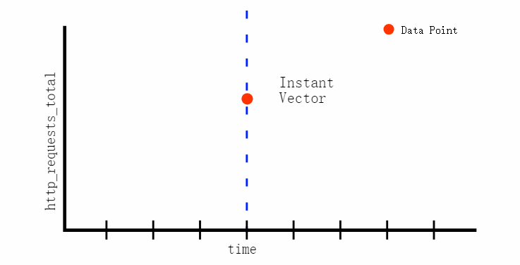
### Range vector
Range vector（范围向量）表示一段时间范围里的时序，每个时序可包含多个点
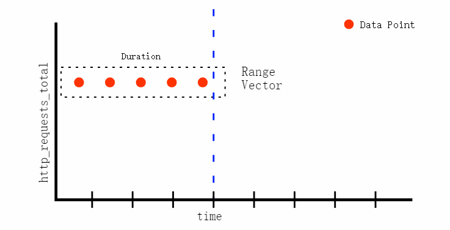
sources：[Understanding Prometheus Range Vectors](https://satyanash.net/software/2021/01/04/understanding-prometheus-range-vectors.html)
### Scalar
Scalar（标量）通常为数值，可以将只有一个时序的Instance vector转换成Scalar。
### String
简单字符串值，目前未被使用。
## 选择器
### 标签选择器
查询Prometheus http状态码为400的请求数量。
```
prometheus_http_requests_total{code="400"}
```
标签匹配运算符:

* = ：与字符串匹配
* != ：与字符串不匹配
* =~ ：与正则匹配
* !~ ：与正则不匹配

查询Prometheus http状态码为4xx或5xx并且handler为/api/v1/query的请求数量
```
prometheus_http_requests_total{code=~"4.*|5.*",handler="/api/v1/query"}
```

内部标签__name__用来匹配指标名称，下面的表达式与上一条等价
```
{code=~"4.*|5.*",handler="/api/v1/query",__name__="prometheus_http_requests_total"}
```
### 范围选择器

查询过去5分钟Prometheus健康检查的采样记录。
```
prometheus_http_requests_total{code="200",handler="/-/healthy"}[5m]
```
单位：ms、s、m、h、d、w、y

时间串联：[1h5m]一小时5分钟

## 时间偏移
### 通过offset

通过offset将时间倒退5分钟，即查询5分钟之前的数据。
```
prometheus_http_requests_total{code="200"} offset 5m 
```
同样支持查询range vector
```
prometheus_http_requests_total{code="200"}[3m] offset 5m
```
### @修饰符
还可以通过@ 直接跳转到某个uinx时间戳，需开启启动参数--enable-feature=promql-at-modifier
```
prometheus_http_requests_total{code="200"} @ 1646089826
```
## 运算符
Prometheus中的运算符与各类编程语言中的基本一致。
### 数学运算符
Prometheus 中存在以下数学运算符：

* +（加法）
* -（减法）
* *（乘法）
* /（除法）
* %（取模）
* ^（幂）
两个标量之间的计算
```
10/3
```
瞬时向量与标量计算，由于计算后值意义与原指标名有差异，Prometheus很贴心的帮我们移除了指标名称。
```
prometheus_http_response_size_bytes_sum / 1024
```
两个瞬时向量间的计算，如下计算node的内存使用率
```
(
1 -
node_memory_MemAvailable_bytes{job="node",instance="localhost:9100"} 
/ node_memory_MemTotal_bytes{job="node",instance="localhost:9100"}
)
* 100
```
如果两个瞬时向量标签不一致可通过ignoring忽略多余标签
输入示例：
```
method_code:http_errors:rate5m{method="get", code="500"}  24
method_code:http_errors:rate5m{method="post", code="500"} 6

method:http_requests:rate5m{method="get"}  600
method:http_requests:rate5m{method="post"} 120
```
查询示例：
```
method_code:http_errors:rate5m{code="500"} / ignoring(code) method:http_requests:rate5m
```
结果示例：
```
{method="get"}  0.04            //  24 / 600
{method="post"} 0.05            //   6 / 120
```
如果两个瞬时向量数量不一致时可通过group_left、group_right指定以那一侧为准
输入示例：
```
method_code:http_errors:rate5m{method="get", code="500"}  24
method_code:http_errors:rate5m{method="get", code="404"}  30
method_code:http_errors:rate5m{method="put", code="501"}  3
method_code:http_errors:rate5m{method="post", code="500"} 6
method_code:http_errors:rate5m{method="post", code="404"} 21

method:http_requests:rate5m{method="get"}  600
method:http_requests:rate5m{method="del"}  34
method:http_requests:rate5m{method="post"} 120
```
查询示例：

group_left以左侧为准
```
method_code:http_errors:rate5m / ignoring(code) group_left method:http_requests:rate5m
```
结果示例：
```
{method="get", code="500"}  0.04            //  24 / 600
{method="get", code="404"}  0.05            //  30 / 600
{method="post", code="500"} 0.05            //   6 / 120
{method="post", code="404"} 0.175           //  21 / 120
```

### 比较运算符

Prometheus 中存在以下比较运算符：

* ==（相等）
* !=（不相等）
* \>（大于）
* <（小于）
* \>=（大于或等于）
* <=（小于或等于）

两个标量之间比较，在运算符后跟bool修饰，结果0( false) 或1 ( true)
```
10 < bool 5
```
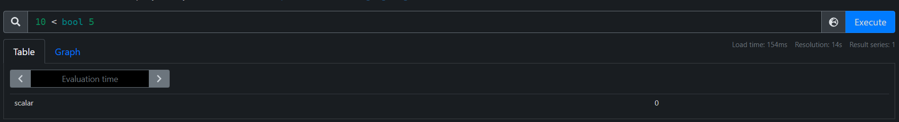
瞬时向量与标量比较，查询node状态
```
up{job="node"} ==  bool 1
```
两个瞬时向量比较，查看消息队列容量状态
```
prometheus_notifications_queue_length < bool prometheus_notifications_queue_capacity
```
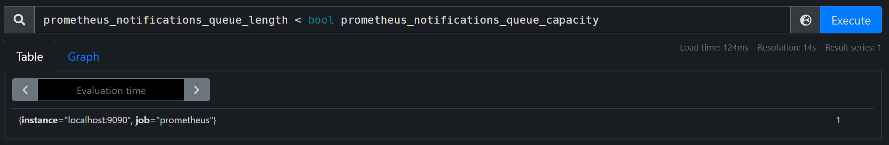
### 逻辑运算符

Prometheus 中存在以下逻辑运算符：

* and（与）
* or（或）
* unless（非）
  
逻辑运算仅适用于向量

如下我们有4个target，进行相应的逻辑运算，实现和标签选择相似效果。
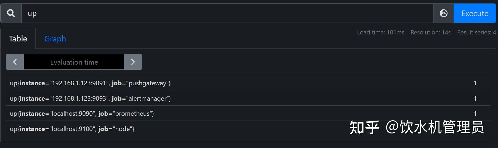
```
up{instance!="192.168.1.123:9091"} and up{job!="alertmanager"}
```
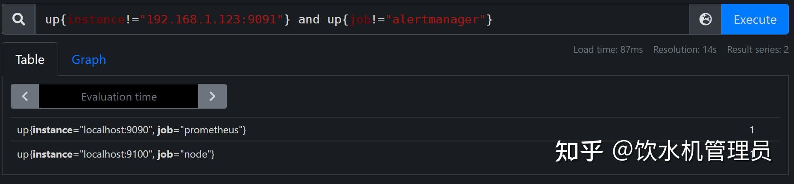
```
up{instance="192.168.1.123:9091"} or up{job="alertmanager"} 
```
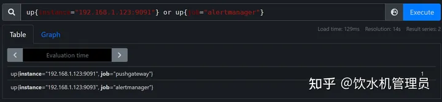
```
up unless up{job="alertmanager"} 
```
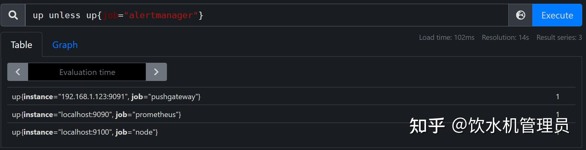
Prometheus 中二元运算符的优先级，从高到低。

1. ^
2. *, /, %,atan2
3. +,-
4. ==, !=, <=, <, >=,>
5. and,unless
6. or


相同优先级的运算符是左结合的
相同优先级的运算符（+ 和 -）是左结合的。这意味着在表达式中，加法和减法运算将按照从左到右的顺序进行。

例如，考虑以下PromQL表达式：
```
a + b - c
```
在这个表达式中，加法运算符（+）和减法运算符（-）具有相同的优先级。根据左结合的规则，这个表达式将首先执行加法运算，然后再执行减法运算。换句话说，计算顺序将是先计算"a + b"，然后将结果与"c"相减。

PromQL中的atan2函数用于计算两个数值的反正切值。它接受两个参数，并返回一个介于-π/2和π/2之间的值，表示从原点到点(y, x)的角度。

具体来说，atan2(y, x)返回的角度是满足以下条件的唯一角度θ：

θ在-π/2和π/2之间；
点(x, y)位于以原点为圆心、半径为1的圆上；
点(x, y)与极坐标中的点(1, θ)对应。
与atan函数不同的是，atan2考虑了y和x的值之间的比例关系，因此能够更准确地描述角度的变化。在处理二维空间中的角度计算时，atan2函数通常比atan函数更常用。

以下是一个PromQL中使用atan2函数的示例：

```
sum(rate(vector_field[1m])) * 100 / atan2(1, 1)
```
这个示例中，使用rate函数计算了一个名为vector_field的时间序列的1分钟平均值，并将其乘以100。然后，通过使用atan2函数将结果除以1和1之间的反正切值，得到一个归一化的结果。
### 聚合运算符
Prometheus 支持以下内置聚合运算符，可用于聚合单个瞬时向量，生成新的向量：

* sum（总和）
* min（最小）
* max（最大）
* avg（平均值）
* group（分组）
* stddev（标准偏差）
* stdvar（标准方差）
* count（计算向量中的元素个数）
* count_values（计算具有相同值的元素个数）
* bottomk（样本值的最小 k 个元素）
* topk（按样本值计算的最大 k 个元素）
* quantile（分位数计算 φ-quantile (0 ≤ φ ≤ 1)


聚合运算符可通过 without、by 根据标签扩展

sum、min、max、avg：

计算http请求的总和，最大、最小请求的url的数量，平均数量
```
sum(prometheus_http_requests_total)
```
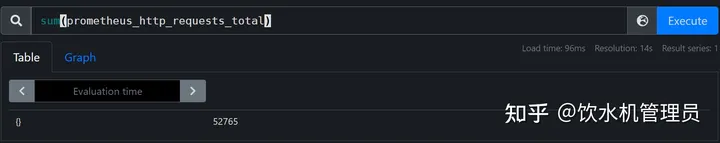
通过状态码分别统计
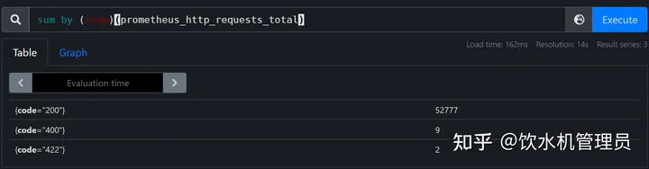
group:

类uniq的用法
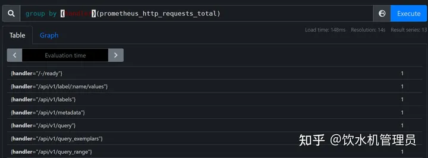

stddev、stdvar：

反映一组数据离散程度，用以衡量数据值偏离算术平均值的程度。标准偏差为方差的开平方，标准偏差越小，这些值偏离平均值就越少，反之亦然。

通过标准差来反映网络波动
```
stddev(rate(node_network_transmit_bytes_total[5m]))
```
rate计算某段时间的速率
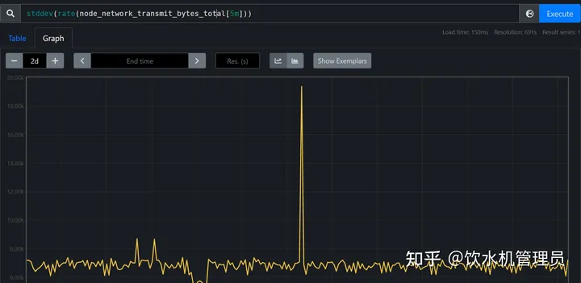
count、count_values:

统计总共有几个时序
```
count(prometheus_http_requests_total)
```
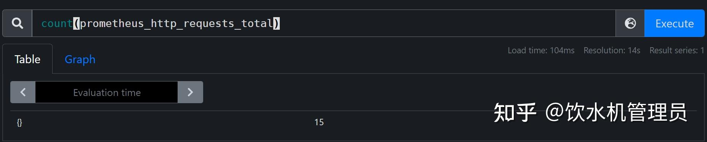
计算每个value的数量
```
count_values("value",prometheus_http_requests_total)
```
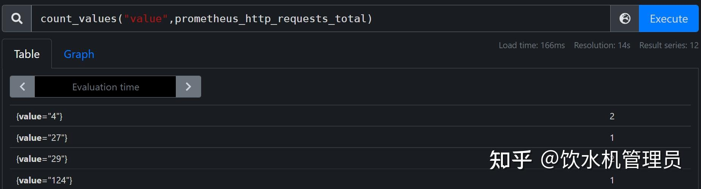

bottomk、topk

计算value中最小的5个时序
```
bottomk(5,prometheus_http_requests_total)
```
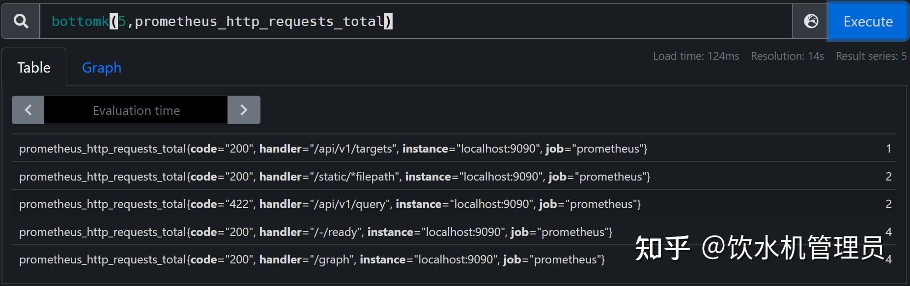

quantile:求数据的分位数

我们现在要找出K8s集群中所有node节点的内存使用率的分布情况:
```
quantile
(0.8,
(
1 -
node_memory_MemAvailable_bytes{job="kubernetes-service-endpoints"} 
/ node_memory_MemTotal_bytes{job="kubernetes-service-endpoints"}
)
* 100
)
```
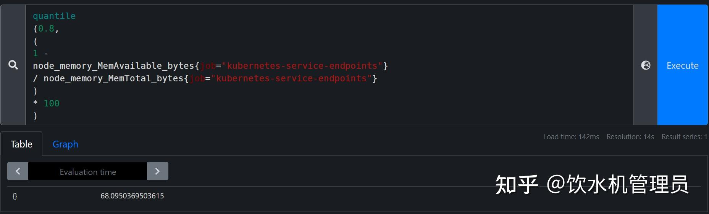

直接可以看出80%的节点内存使用率在68%以下

## 函数
### 值取整
#### ceil()
ceil(v instant-vector)样本数据向上取整。
```
ceil(node_load1)  #1.2-->2
```
#### floor()
floor(v instant-vector)与ceil()相反，floor()样本值向下取整。
#### round()
round(v instant-vector, to_nearest=1 scalar) 对样本值四舍五入取整。to_nearest参数是可选的,默认为 1,表示样本返回的是最接近 1 的整数倍的值，参数可以为分数。

取整
```
round(prometheus_engine_query_duration_seconds_sum)
```
取整到最近的5的倍数
```
round(prometheus_engine_query_duration_seconds_sum,5)
```
### 值截取
#### clamp()

clamp(v instant-vector, min scalar, max scalar) 截取所有元素的样本值在 [min,max]集合内的样本,如果min>max返回NaN

放回样本值在10到20的样本
```
clamp(prometheus_http_requests_total,10,20)
```
#### clamp_max()

clamp_max(v instant-vector, max scalar) 同clamp()，不过只限定样本最大值

#### clamp_min()

clamp_min(v instant-vector, min scalar) 同clamp()，不过只限定样本最小值
### 值变化统计
#### changes()

changes(v range-vector)返回某段时间内样本值改变的次数
```
changes(node_load1[1m])
```
### 复位统计
#### resets()

resets(v range-vector) 返回样本范围时间内的复位次数。与counter使用，两个连续样本之间值如有减少则被视为计数器复位。

查看上下文交换次数计数器在5分钟内复位次数
```
resets(node_context_switches_total[5m])
```
### 日期与时间管理
#### day_of_month()

day_of_month(v=vector(time()) instant-vector)如果样本值是utc时间，则返回这个时间所属月份中的日期（1-31）

v=vector(time()) 为默认参数
```
day_of_month(node_boot_time_seconds)
```
#### day_of_week()

day_of_week(v=vector(time()) instant-vector)同上，如果样本值是utc时间，则返回这个时间所属星期几（0-6）

#### days_in_month()

days_in_month(v=vector(time()) instant-vector)如果样本值是utc时间，则返回这个时间所属月份的天数（28-31）

#### hour()

hour(v=vector(time()) instant-vector)如果样本值是utc时间，则返回这个时间所属一天中的第几个小时（1-13）

#### minute()

minute(v=vector(time()) instant-vector) 如果样本值是utc时间，则返回这个时间所属小时中的第几分钟（1-59）

#### month()

month(v=vector(time()) instant-vector)如果样本值是utc时间，则返回这个时间所属的月份（1-12）

#### year()

year(v=vector(time()) instant-vector)如果样本值是utc时间，则返回这个时间所属的年份

#### time()

返回自1970 年 1 月 1 日 UTC 以来的秒数，不是系统时间，而是表达式计算时那一刻的时间。

#### timestamp()

timestamp(v instant-vector)返回每个样本值的时间戳，自 1970 年 1 月 1 日 UTC 以来的秒数。

### 直方图分位数
#### histogram_quantile()

histogram_quantile(φ float, b instant-vector) 从 bucket 类型的向量 b 中计算 φ (0 ≤ φ ≤ 1) 分位数的样本的最大值，与聚合运算符quantile相似。

计算80%请求的持续时间最大值。
```
histogram_quantile(0.8,rate(prometheus_http_request_duration_seconds_bucket[1d]))
```
### 差异与增长率
#### delta()

delta(v range-vector)计算范围向量中每个时间序列元素的第一个值和最后一个值之间的差。与指标类型gauge一起使用

计算一天内内存可用量的变化

delta(node_memory_MemAvailable_bytes[1d])
#### idelta()

idelta(v range-vector)计算范围向量中最后两个样本之间的差异。与指标类型gauge一起使用

idelta(node_memory_MemAvailable_bytes[1m])
#### increase()

increase(v range-vector) 计算时间范围内的增量，与counter一起使用。它是速率rate(v)乘以时间范围内秒数的语法糖，主要用于人类可读性。

计算10分钟内请求增长量
```
increase(prometheus_http_requests_total[10m])
```
#### rate()

rate(v range-vector)计算范围向量中时间序列的平均每秒增长率。

过去10分钟请求平均每秒增长率，与counter一起使用。
```
rate(prometheus_http_requests_total[10m])
```
#### irate()

irate(v range-vector) 通过时间范围的最后两个点来计算每秒瞬时增长率。
```
irate(prometheus_http_requests_total[10m])
```
### label管理
#### label_join()

label_join(v instant-vector, dst_label string, separator string, src_label_1 string, src_label_2 string, ...)为每个时间序列添加一个label，值为指定旧label的value连接
```
label_join(up{instance="localhost:9100", job="node"},"new_label","-","instance","job")
```
结果：
```
up{instance="localhost:9100", job="node", new_label="localhost:9100-node"}   1
```
#### label_replace()

label_replace(v instant-vector, dst_label string, replacement string, src_label string, regex string)从源label中获取value元素用于添加新的label

$1 获取正则匹配，匹配值添加到hello标签中
```
label_replace(up{instance="localhost:9100", job="node"},"hello","$1","job","(.*)")
```
结果：
```
up{hello="node", instance="localhost:9100", job="node"}       1
```

### 预测
#### predict_linear()

predict_linear(v range-vector, t scalar) 通过简单线性回归预测t秒后的样本值，与gauge一起使用。

根据过去1小时的文件系统剩余空间量，预测1小时之后的剩余空间
```
predict_linear(node_filesystem_free_bytes[1h],3600)
```
### 转换
#### absent()

absent(v instant-vector)如果向量有元素，则返回一个空向量；如果向量没有元素，则返回值为 1。

设置如下告警表达式：
```
absent(up{job="node"} == 1)
```
由于up{job="node"}不存在或值不为1则告警表达式的值为1 产生告警

#### absent_over_time()

absent_over_time(v range-vector)如果范围向量有元素，则返回一个空向量；如果范围向量没有元素，则返回值为 1。

如果up{job="node1"}在某段时间不存在则返回1
```
absent_over_time(up{job="node1"}[1h])
```
#### scalar()

scalar(v instant-vector)以标量形式返回该单元素的样本值,如果输入向量不是正好一个元素，scalar将返回NaN.

#### vector()

vector(s scalar)将标量作为没有标签的向量返回。

#### sgn()

sgn(v instant-vector)返回一个向量，其中所有样本值都转换为1或-1或0

定义如下：

如果 v 为正，则为 1

如果 v 为负，则为 -1

如果 v 等于 0，则为 0。

### 排序
#### sort()

sort(v instant-vector)返回按样本值升序排序的向量元素。

#### sort_desc()

与sort()相反，按降序排序。

#### _over_time()
下面的函数列表允许传入一个范围向量，返回一个带有聚合的瞬时向量：

* avg_over_time(range-vector): 区间向量内每个度量指标的平均值。
* min_over_time(range-vector): 区间向量内每个度量指标的最小值。
* max_over_time(range-vector): 区间向量内每个度量指标的最大值。
* sum_over_time(range-vector): 区间向量内每个度量指标的求和值。
* count_over_time(range-vector): 区间向量内每个度量指标的样本数据个数。
* quantile_over_time(scalar, range-vector): 区间向量内每个度量指标的样本数据值分位数，φ-quantile (0 ≤ φ ≤ 1)
* stddev_over_time(range-vector): 区间向量内每个度量指标的总体标准偏差。
* stdvar_over_time(range-vector): 区间向量内每个度量指标的总体标准方差

### 数学函数
#### abs()

abs(v instant-vector)返回样本的绝对值。

#### sqrt()

sqrt(v instant-vector)计算样本值的平方根。

#### deriv()

deriv(v range-vector) 使用简单线性回归计算时间序列在范围向量中的每秒导数。与指标类型gauge一起使用

#### exp()

exp(v instant-vector)计算样本值的指数函数。

特殊情况：

* Exp(+Inf) = +Inf
* Exp(NaN) = NaN
#### ln()、log2()、log10()

ln/log2/log10(v instant-vector) 计算样本值对数

特殊情况（同适用于log2/log10）：

* ln(+Inf) = +Inf
* ln(0) = -Inf
* ln(x < 0) = NaN
* ln(NaN) = NaN


#### holt_winters()

holt_winters(v range-vector, sf scalar, tf scalar)基于访问向量v，生成时间序列数据平滑数据值。平滑因子sf越低, 对旧数据越重要。趋势因子tf越高，更关心趋势数据。0<sf,tf<=1。 与gauge一起使用

### 三角函数、弧度

* acos(v instant-vector)
* acosh(v instant-vector)
* asin(v instant-vector)
* asinh(v instant-vector)
* atan(v instant-vector)
* atanh(v instant-vector)
* cos(v instant-vector)
* cosh(v instant-vector)
* sin(v instant-vector)
* sinh(v instant-vector)
* tan(v instant-vector)
* tanh(v instant-vector)

### 角度、弧度转化

* deg(v instant-vector)
* pi()
* rad(v instant-vector)

原文地址: https://zhuanlan.zhihu.com/p/477177336