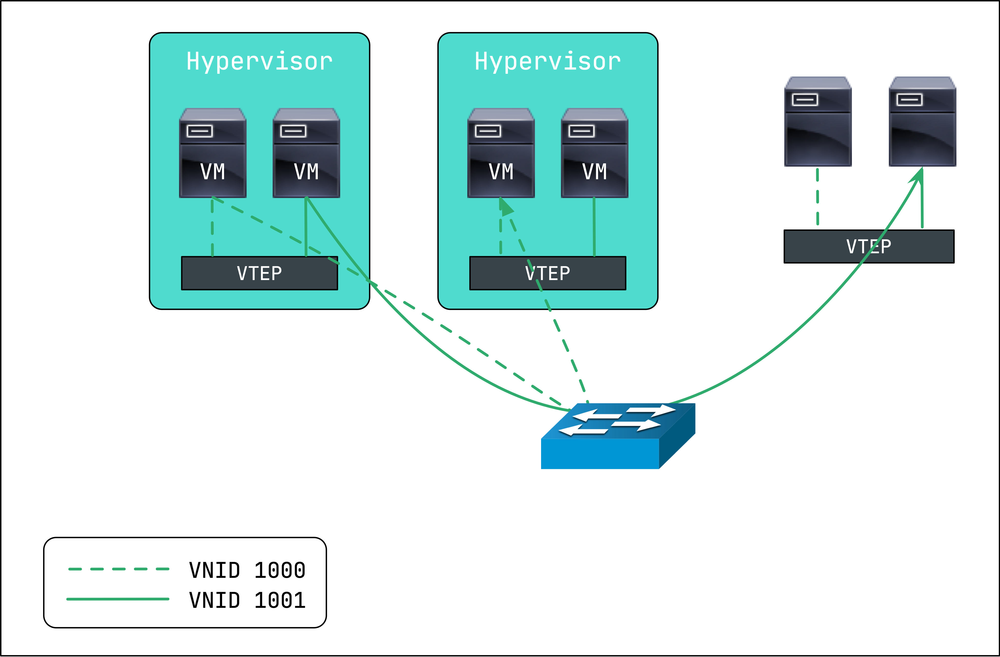
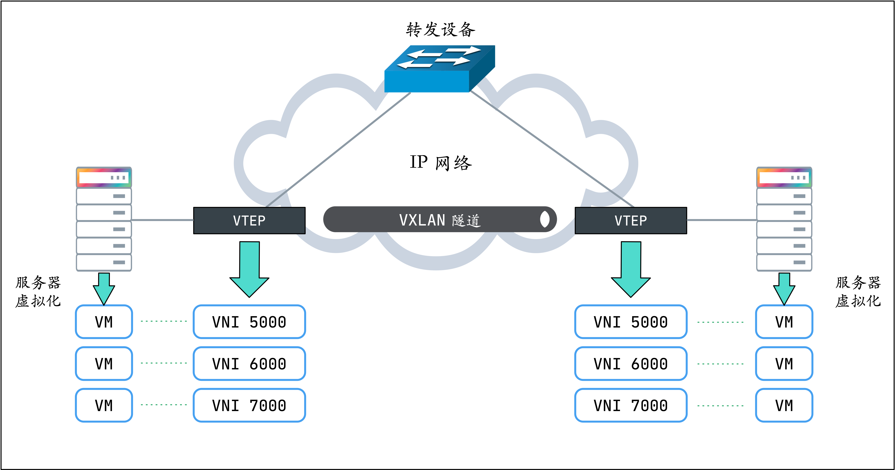
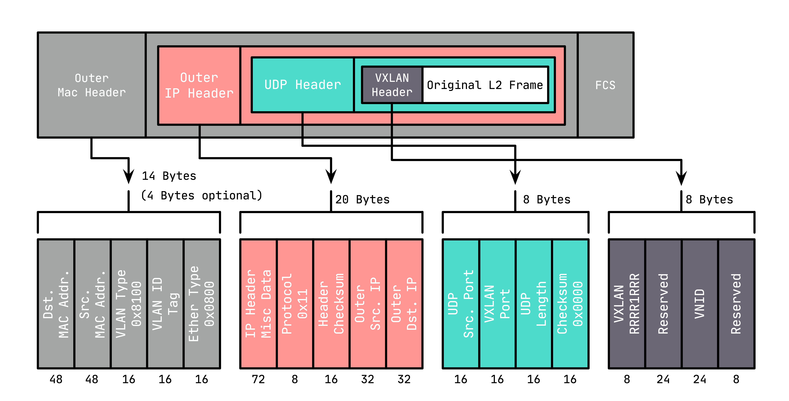
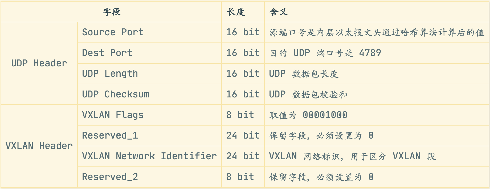
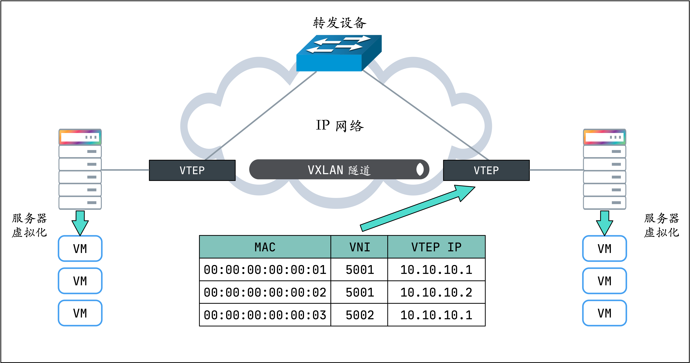
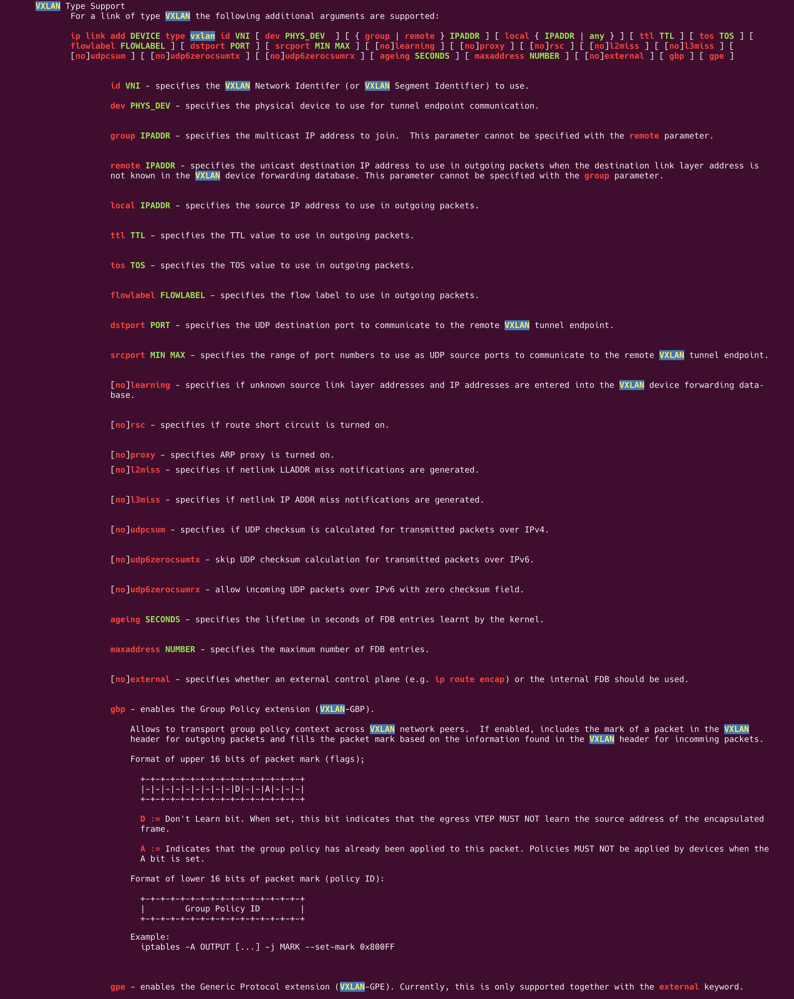

VXLAN（Virtual eXtensible Local Area Network，虚拟可扩展局域网），是一种虚拟化隧道通信技术。它是一种 Overlay（覆盖网络）技术，通过三层的网络来搭建虚拟的二层网络。

简单来讲，VXLAN 是在底层物理网络（underlay）之上使用隧道技术，借助 UDP 层构建的 Overlay 的逻辑网络，使逻辑网络与物理网络解耦，实现灵活的组网需求。它对原有的网络架构几乎没有影响，不需要对原网络做任何改动，即可架设一层新的网络。也正是因为这个特性，很多 CNI 插件（Kubernetes 集群中的容器网络接口，这个大家应该都知道了吧，如果你不知道，现在你知道了）才会选择 VXLAN 作为通信网络。

VXLAN 不仅支持一对一，也支持一对多，一个 VXLAN 设备能通过像网桥一样的学习方式学习到其他对端的 IP 地址，还可以直接配置静态转发表。

一个典型的数据中心 VXLAN 网络拓扑图如图所示：


其中 VM 指的是虚拟机，Hypervisor 指的是虚拟化管理器。
## 1.  为什么需要 VXLAN？
与 VLAN 相比，VXLAN 很明显要复杂很多，再加上 VLAN 的先发优势，已经得到了广泛的支持，那还要 VXLAN 干啥？

### VLAN ID 数量限制
VLAN tag 总共有 4 个字节，其中有 12 bit 用来标识不同的二层网络（即 LAN ID），故而最多只能支持 $2^{12}$，即 4096 个子网的划分。而虚拟化（虚拟机和容器）的兴起使得一个数据中心会有成千上万的机器需要通信，这时候 VLAN 就无法满足需求了。而 VXLAN 的报文 Header 预留了 24 bit 来标识不同的二层网络（即 VNI，VXLAN Network Identifier），即 3 个字节，可以支持 $2^{24}$ 个子网。

### 交换机 MAC 地址表限制
对于同网段主机的通信而言，报文到底交换机后都会查询 MAC 地址表进行二层转发。数据中心虚拟化之后，VM 的数量与原有的物理机相比呈数量级增长，而应用容器化之后，容器与 VM 相比也是呈数量级增长。。。而交换机的内存是有限的，因而 MAC 地址表也是有限的，随着虚拟机（或容器）网卡 MAC 地址数量的空前增加，交换机表示压力山大啊！

而 VXLAN 就厉害了，它用 VTEP（后面会解释）将二层以太网帧封装在 UDP 中，一个 VTEP 可以被一个物理机上的所有 VM（或容器）共用，一个物理机对应一个 VTEP。从交换机的角度来看，只是不同的 VTEP 之间在传递 UDP 数据，只需要记录与物理机数量相当的 MAC 地址表条目就可以了，一切又回到了和从前一样。

### 虚机或容器迁移范围受限
VLAN 与物理网络融合在一起，不存在 Overlay 网络，带来的问题就是虚拟网络不能打破物理网络的限制。举个例子，如果要在 VLAN 100 部署虚拟机（或容器），那只能在支持 VLAN 100 的物理设备上部署。

VLAN 其实也有解决办法，就是将所有的交换机 Trunk 连接起来，产生一个大的二层，这样带来的问题就是广播域过分扩大，也包括更多未知的单播和多播，即 BUM（Broadcast，Unknown Unicast，Multicast），同时交换机 MAC 地址表也会有承受不住的问题。

而 VXLAN 将二层以太网帧封装在 UDP 中（上面说过了），相当于在三层网络上构建了二层网络。这样不管你物理网络是二层还是三层，都不影响虚拟机（或容器）的网络通信，也就无所谓部署在哪台物理设备上了，可以随意迁移。

总的来说，传统二层和三层的网络在应对这些需求时变得力不从心，虽然很多改进型的技术比如堆叠、SVF、TRILL 等能够增加二层的范围，努力改进经典网络，但是要做到对网络改动尽可能小的同时保证灵活性却非常困难。为了解决这些问题，有很多方案被提出来，Overlay 就是其中之一，而 VXLAN 是 Overlay 的一种典型的技术方案。下面就对 Overlay 做一个简要的介绍。
## 2. Overlay 是个啥？
Overlay 在网络技术领域，指的是一种网络架构上叠加的虚拟化技术模式，其大体框架是对基础网络不进行大规模修改的条件下，实现应用在网络上的承载，并能与其它网络业务分离，并且以基于 IP 的基础网络技术为主。

IETF 在 Overlay 技术领域提出 VXLAN、NVGRE、STT 三大技术方案。大体思路均是将以太网报文承载到某种隧道层面，差异性在于选择和构造隧道的不同，而底层均是 IP 转发。VXLAN 和 STT 对于现网设备而言对流量均衡要求较低，即负载链路负载分担适应性好，一般的网络设备都能对 L2-L4 的数据内容参数进行链路聚合或等价路由的流量均衡，而 NVGRE 则需要网络设备对 GRE 扩展头感知并对 flow ID 进行 HASH，需要硬件升级；STT 对于 TCP 有较大修改，隧道模式接近 UDP 性质，隧道构造技术属于革新性，且复杂度较高，而 VXLAN 利用了现有通用的 UDP 传输，成熟性极高。

总体比较，VLXAN 技术具有更大优势，而且当前 VLXAN 也得到了更多厂家和客户的支持，已经成为 Overlay 技术的主流标准。
## 3. VXLAN 协议原理
VXLAN 有几个常见的术语：

* VTEP（VXLAN Tunnel Endpoints，VXLAN 隧道端点）

VXLAN 网络的边缘设备，用来进行 VXLAN 报文的处理（封包和解包）。VTEP 可以是网络设备（比如交换机），也可以是一台机器（比如虚拟化集群中的宿主机）。

* VNI（VXLAN Network Identifier，VXLAN 网络标识符）

VNI 是每个 VXLAN 段的标识，是个 24 位整数，一共有 $2^{24} = 16777216$（一千多万），一般每个 VNI 对应一个租户，也就是说使用 VXLAN 搭建的公有云可以理论上可以支撑千万级别的租户。

* Tunnel（VXLAN 隧道）

隧道是一个逻辑上的概念，在 VXLAN 模型中并没有具体的物理实体向对应。隧道可以看做是一种虚拟通道，VXLAN 通信双方认为自己是在直接通信，并不知道底层网络的存在。从整体来说，每个 VXLAN 网络像是为通信的虚拟机搭建了一个单独的通信通道，也就是隧道。

上图所示为 VXLAN 的工作模型，它创建在原来的 IP 网络（三层）上，只要是三层可达（能够通过 IP 相互通信）的网络就能部署 VXLAN。在 VXLAN 网络的每个端点都有一个 VTEP 设备，负责 VXLAN 协议报文的解包和封包，也就是在虚拟报文上封装 VTEP 通信的报文头部。

物理网络上可以创建多个 VXLAN 网络，可以将这些 VXLAN 网络看成一个隧道，不同节点上的虚拟机/容器能够通过隧道直连。通过 VNI 标识不同的 VXLAN 网络，使得不同的 VXLAN 可以相互隔离。

VXLAN 的报文结构如下图所示：


* VXLAN Header : 在原始二层帧的前面增加 8 字节的 VXLAN 的头部，其中最主要的是 VNID，占用 3 个字节（即 24 bit），类似 VLAN ID，可以具有 $2^{24}$ 个网段。

* UDP Header : 在 VXLAN 和原始二层帧的前面使用 8 字节 UDP 头部进行封装（MAC IN UDP），目的端口号缺省使用 4789，源端口按流随机分配（通过 MAC，IP，四层端口号进行 hash 操作）， 这样可以更好的做 ECMP。

IANA（Internet As-signed Numbers Autority）分配了 4789 作为 VXLAN 的默认目的端口号。

在上面添加的二层封装之后，再添加底层网络的 IP 头部（20 字节）和 MAC 头部（14 字节），这里的 IP 和 MAC 是宿主机的 IP 地址和 MAC 地址。

同时，这里需要注意 MTU 的问题，传统网络 MTU 一般为 1500，这里加上 VXLAN 的封装多出的（36+14/18，对于 14 的情况为 access 口，省去了 4 字节的 VLAN Tag）50 或 54 字节，需要调整 MTU 为 1550 或 1554，防止频繁分包。

### VXLAN 的 Flood 与 Learn
总的来说，VXLAN 报文的转发过程就是：原始报文经过 VTEP，被 Linux 内核添加上 VXLAN 头部以及外层的 UDP 头部，再发送出去，对端 VTEP 接收到 VXLAN 报文后拆除外层 UDP 头部，并根据 VXLAN 头部的 VNI 把原始报文发送到目的服务器。但这里有一个问题，第一次通信前双方如何知道所有的通信信息？这些信息包括：

哪些 VTEP 需要加到一个相同的 VNI 组？
发送方如何知道对方的 MAC 地址？
如何知道目的服务器在哪个节点上（即目的 VTEP 的地址）？
第一个问题简单，VTEP 通常由网络管理员来配置。要回答后面两个问题，还得回到 VXLAN 协议的报文上，看看一个完整的 VXLAN 报文需要哪些信息：

* 内层报文 : 通信双方的 IP 地址已经明确，只需要 VXLAN 填充对方的 MAC 地址，因此需要一个机制来实现 ARP 功能。

* VXLAN 头部 : 只需要知道 VNI。一般直接配置在 VTEP 上，要么提前规划，要么根据内层报文自动生成。

* UDP 头部 : 需要知道源端口和目的端口，源端口由系统自动生成，目的端口默认是 4789。

* IP 头部 : 需要知道对端 VTEP 的 IP 地址，这个是最关键的部分。

实际上，VTEP 也会有自己的转发表，转发表通过泛洪和学习机制来维护，对于目标 MAC 地址在转发表中不存在的未知单播，广播流量，都会被泛洪给除源 VTEP 外所有的 VTEP，目标 VTEP 响应数据包后，源 VTEP 会从数据包中学习到 MAC，VNI 和 VTEP 的映射关系，并添加到转发表中，后续当再有数据包转发到这个 MAC 地址时，VTEP 会从转发表中直接获取到目标 VTEP 地址，从而发送单播数据到目标 VTEP。


VTEP 转发表的学习可以通过以下两种方式：

多播
外部控制中心（如 Flannel、Cilium 等 CNI 插件）
* MAC 头部 : 确定了 VTEP 的 IP 地址，后面就好办了，MAC 地址可以通过经典的 ARP 方式获取。

## 4. Linux 的 VXLAN
Linux 对 VXLAN 协议的支持时间并不久，2012 年 Stephen Hemminger 才把相关的工作合并到 kernel 中，并最终出现在 kernel 3.7.0 版本。为了稳定性和很多的功能，可能会看到某些软件推荐在 3.9.0 或者 3.10.0 以后版本的 kernel 上使用 VXLAN。

到了 kernel 3.12 版本，Linux 对 VXLAN 的支持已经完备，支持单播和组播，IPv4 和 IPv6。利用 man 查看 ip 的 link 子命令，可以查看是否有 VXLAN type：
```
$ man ip-link
```
搜索 VXLAN，可以看到如下描述：

### 管理 VXLAN 接口
1. Linux VXLAN 接口的基本管理如下：
创建点对点的 VXLAN 接口：
```
$ ip link add vxlan0 type vxlan id 4100 remote 192.168.1.101 local 192.168.1.100 dstport 4789 dev eth0
```
其中 id 为 VNI，remote 为远端主机的 IP，local 为你本地主机的 IP，dev 代表 VXLAN 数据从哪个接口传输。

在 VXLAN 中，一般将 VXLAN 接口（本例中即 vxlan0）叫做 VTEP。
2. 创建多播模式的 VXLAN 接口：
```
$ ip link add vxlan0 type vxlan id 4100 group 224.1.1.1 dstport 4789 dev eth0
```
多播组主要通过 ARP 泛洪来学习 MAC 地址，即在 VXLAN 子网内广播 ARP 请求，然后对应节点进行响应。group 指定多播组的地址。

3. 查看 VXLAN 接口详细信息：
```
$ ip -d link show vxlan0
```
#### FDB 表

FDB（Forwarding Database entry，即转发表）是 Linux 网桥维护的一个二层转发表，用于保存远端虚拟机/容器的 MAC地址，远端 VTEP IP，以及 VNI 的映射关系，可以通过 bridge fdb 命令来对 FDB 表进行操作：

* 条目添加：
```
$ bridge fdb add <remote_host_mac> dev <vxlan_interface> dst <remote_host_ip>
```
* 条目删除：
```
$ bridge fdb del <remote_host_mac> dev <vxlan_interface>
```
* 条目更新：
```
$ bridge fdb replace <remote_host_mac> dev <vxlan_interface> dst <remote_host_ip>
```
* 条目查询：
```
$ bridge fdb show
```
## 5. 总结
本文通过介绍 VXLAN 出现的时代背景、VXLAN 的概念和网络模型、VXLAN 报文结构，让你对 VXLAN 有了初步的认识；通过介绍 VXLAN 转发表的泛洪和学习，让你知道了通信双方如何感知对方；最后介绍了 Linux 中 VXLAN 的基本配置，让你进一步了解如何在 Linux 中玩转 VXLAN。下一篇文章将会通过实战来说明如何搭建基于 VXLAN 的 Overlay 网络，顺便展开解读上文提到的多播和外部控制中心的工作原理。

原文地址: https://zhuanlan.zhihu.com/p/130277008#:~:text=%E7%AE%80%E5%8D%95%E6%9D%A5%E8%AE%B2%EF%BC%8C%20VXLAN%20%E6%98%AF,%E4%B8%80%E5%B1%82%E6%96%B0%E7%9A%84%E7%BD%91%E7%BB%9C%E3%80%82